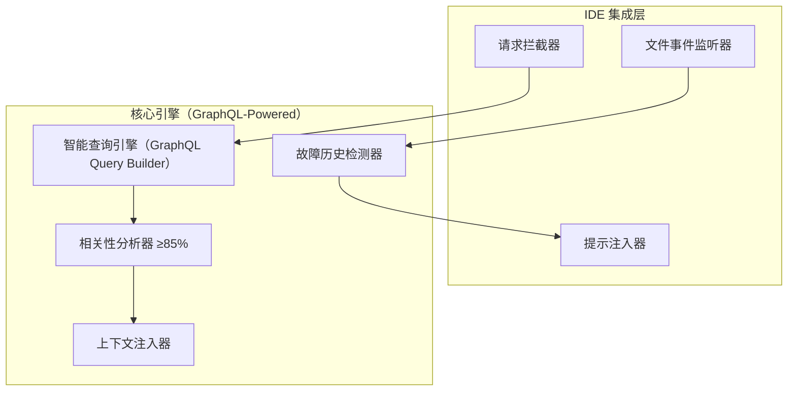
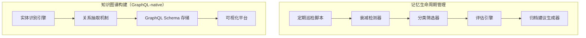

# 系统性复盘与记忆管理技能 (Systematic Review & Memory Management Skill) Specification

## 1. 概述与设计哲学 (Overview & Design Philosophy)

### 1.1 Why（背景与动机）

当前 AI 助手在执行复杂工程项目时缺乏跨会话的记忆管理能力，导致无法从历史任务中提取和复用经验。需要构建一个 **基于图思维（Graph Thinking）** 的结构化复盘与记忆管理机制，使 AI 能够自动提取高价值经验、沉淀最佳实践、避免重复错误，并支持团队协作与跨平台同步。

### 1.2 设计哲学（Design Philosophy - Pure GraphQL & MyST）

本技能的设计理念深度融合 **GraphQL 的完整类型系统与查询语义** 与 **MyST (Markedly Structured Text) 的人类可读优先理念**：

| 核心理念 | 说明 | 在本技能中的体现 |
|---------|------|----------------|
| **一切皆是图** | 将复盘记录建模为 GraphQL 图节点（Node），通过 Edge 建立关系 | `issue_url`、`pr_url` 实现双向追溯 |
| **Schema 即契约** | GraphQL SDL 作为唯一的数据契约定义 | `schema.graphql` 定义强类型约束 |
| **按需获取** | 极致的 Token 优化策略（Field Selection） | 仅返回用户请求的核心字段 |
| **Query/Mutation 分离** | 严格区分只读查询与带副作用的写入操作 | 四条指令清晰分离读写职责 |
| **强类型验证** | 编译时 + 运行时双重类型检查 | 所有数据操作均经过 GraphQL 类型系统校验 |
| **人类可读优先** | 采用 MyST 规范作为主存储格式 | `.md` 文件兼顾可读性与可解析性 |

### 1.3 What Changes（变更范围）

#### 新建组件
- **技能主文件**: `SKILL.md`（技能定义与 Prompt）
- **GraphQL Schema**: `src/schema.graphql`（强类型 SDL 定义）
- **转换工具**: `tools/md_graphql_converter.py`（MyST MD ↔ GraphQL 双向转换）
- **校验工具**: `tools/validate_graphql_schema.py`（GraphQL Schema 合规性校验）
- **模板文件**: `templates/review_template.myst`（复盘记录标准模板）
- **自动化脚本**: CI/CD 工作流及相关处理模块

#### 核心功能模块
1. **复盘分析引擎**（Mutation Operation）- 深度解析交互历史，提取关键决策点与经验
2. **结构化存储层**（Persistent Layer）- MyST Markdown 作为主存储，GraphQL Schema 作为映射层
3. **高效检索引擎**（Query Operation）- 参数化多维度查询
4. **记忆管理系统**（Mutation Operations）- 更新、归档、版本迭代
5. **Token 优化控制器**（Field Selection Philosophy）- 极致精简的输入输出策略
6. **图关系建模器**（Graph Relationships）- 外部系统追溯链接

### 1.4 Impact（影响范围）

| 影响维度 | 具体内容 |
|---------|---------|
| **Affected specs** | 无（全新技能） |
| **Affected code** | 新建技能目录及配套脚本 |
| **依赖工具** | Glob, Grep, Read, Write（白名单工具集） |
| **存储路径** | `.storage/reviews/`（业务数据）、`.cache/reviews/`（缓存） |

---

## 2. 当前局限性与解决方案 (Current Limitations & Solutions)

### 2.1 传统 REST/JSON 存储模式的局限性分析

经过深入分析，传统基于 REST API 和 JSON 数据交换的模式存在以下 **6 大核心局限性**：

| 编号 | 局限类型 | 具体描述 | 影响程度 |
|-----|---------|---------|---------|
| L1 | **Over-fetching / Under-fetching** | 固定端点返回固定结构，无法按需获取字段 | 🔴 严重 |
| L2 | **弱类型约束** | JSON 缺乏编译时类型检查，运行时才发现错误 | 🔴 严重 |
| L3 | **多端点碎片化** | 资源分散在多个 URL，需多次请求组装数据 | 🟠 中等 |
| L4 | **版本控制困难** | 接口演进缺乏向后兼容机制 | 🟠 中等 |
| L5 | **文档同步问题** | API 文档与实际实现容易不一致 | 🟡 轻微 |
| L6 | **嵌套查询复杂** | 关联数据需要客户端手动拼接 | 🟡 轻微 |

### 2.2 GraphQL 规范优势对照

本项目采用 **GraphQL 完整规范** 解决传统 REST/JSON 模式的局限性：

| 编号 | GraphQL 优势 | 解决的局限性 |
|-----|-------------|------------|
| A1 | **强类型系统**（SDL 定义完整类型层次） | L2 弱类型约束 |
| A2 | **按需字段选择**（客户端精确指定所需字段） | L1 Over/Under-fetching |
| A3 | **单端点聚合**（所有操作通过单一 Endpoint） | L3 多端点碎片化 |
| A4 | **内省能力**（自动生成文档） | L5 文档同步问题 |
| A5 | **Query/Mutation 分离**（读写操作清晰分离） | L3, L4 |
| A6 | **变量与参数化**（强类型 Input Types） | L1, L2 |
| A7 | **渐进式演进**（Additive Changes 策略） | L4 版本控制困难 |
| A8 | **订阅支持**（实时数据推送，未来扩展） | L6 嵌套查询复杂 |

> **💡 核心决策**：采用 **GraphQL SDL 作为类型契约**，MyST Markdown 作为人类可读的主存储，两者通过 `md_graphql_converter.py` 保持同步（详见 §3.6）。

---

## 3. 核心功能定义 (Core Feature Definitions)

### 3.1 Requirement: GraphQL 强类型数据模型 (Strongly-Typed Data Model via GraphQL)

系统 SHALL 采用 **完整的 GraphQL Type System（SDL）** 来定义所有复盘记录的数据结构和操作契约。

#### 3.1.1 自定义标量类型（Custom Scalar Types）

```graphql
"""
唯一标识符，格式：REV-YYYYMMDD-NNN
示例：REV-20260417-001
"""
scalar ReviewID @specifiedBy(url: "https://specs.example.com/review-id")

"""
ISO 8601 日期时间字符串
示例：2026-04-17T08:24:00Z
"""
scalar DateTime @specifiedBy(url: "http://tools.ietf.org/html/rfc3339")
```

#### 3.1.2 枚举类型（Enumeration Types）

```graphql
"""
复盘记录的状态枚举
"""
enum ReviewStatus {
  """
  活跃状态（默认值），记录可被检索和更新
  """
  ACTIVE

  """
  已归档状态，记录仅可读不可修改
  """
  ARCHIVED
}

"""
任务类型枚举，用于分类复盘场景
"""
enum TaskType {
  """功能实现"""
  FEATURE_IMPLEMENTATION
  """Bug 修复"""
  BUG_FIX
  """代码重构"""
  REFACTORING
  """架构升级"""
  ARCHITECTURE_UPGRADE
  """故障处理"""
  INCIDENT_RESOLUTION
  """技术决策"""
  TECH_DECISION
  """其他类型"""
  OTHER
}
```

#### 3.1.3 对象类型（Object Type）：Review Node

```graphql
"""
复盘记录节点（Review Node）
系统的核心数据单元，表示一次完整的任务复盘记录
"""
type Review implements Node {
  """
  全局唯一标识符（非空）
  格式约束：REV-{YYYYMMDD}-{NNN}
  """
  id: ID!

  """
  复盘记录的业务标识符（非空）
  使用自定义标量 ReviewID，内置格式校验
  """
  reviewId: ReviewID!

  """
  创建时间戳（非空）
  ISO 8601 格式，精确到秒
  """
  timestamp: DateTime!

  """
  参与者列表（非空数组）
  至少包含一个参与者（创建者本人）
  """
  participants: [String!]!

  """
  任务类型（非空枚举）
  必须为 TaskType 中预定义的值之一
  """
  taskType: TaskType!

  """
  关键决策列表（非空数组）
  记录本次任务中的重要技术选型和架构决策
  """
  decisions: [String!]!

  """
  成功因素列表（非空数组）
  提炼本次执行过程中的成功经验和亮点
  """
  successFactors: [String!]!

  """
  失败原因列表（非空数组）
  记录遇到的问题、坑点和教训
  """
  failureReasons: [String!]!

  """
  最佳实践列表（非空数组）
  从失败中提炼的可复用的标准化操作流程
  """
  bestPractices: [String!]!

  """
  行动项列表（非空数组）
  后续待办事项，包含负责人、截止日期、验收标准
  """
  actionItems: [String!]!

  """
  当前状态（非空枚举，默认值：ACTIVE）
  ACTIVE = 可检索可更新；ARCHIVED = 仅只读
  """
  status: ReviewStatus!

  """
  Schema 版本号（可选，默认："1.2"）
  用于向后兼容性和迁移检测
  """
  schemaVersion: String

  """
  关联 Issue URL（可选，图关系边：向上追溯）
  支持 GitHub/GitLab/AtomGit Issues URL 格式
  """
  issueUrl: String

  """
  关联 PR/MR URL（可选，图关系边：向上追溯）
  支持 GitHub/GitLab/AtomGit Pull/Merge Request URL 格式
  """
  prUrl: String

  """
  项目标识（可选）
  用于跨项目检索和分组
  """
  projectId: String

  """
  标签列表（可选）
  用于多维分类和快速筛选
  """
  tags: [String!]

  """
  核心结论摘要（可选，≤150 字符）
  一句话总结本次复盘的最重要发现
  """
  coreConclusion: String
}
```

> **📌 设计说明**：
> - 采用 **Node Interface** 实现（`implements Node`），为未来 GraphQL Relay 规范兼容预留
> - 字段命名遵循 **camelCase** 规范（GraphQL 官方推荐）
> - 每个字段均有详细注释说明，支持 GraphQL Introspection 自动生成文档

#### 3.1.4 接口类型（Interface Type）：Node

```graphql
"""
全局节点接口（Global Node Interface）
符合 GraphQL Relay 规范，为所有实体提供统一访问入口
"""
interface Node {
  """
  全局唯一标识符
  """
  id: ID!
}
```

#### 3.1.5 输入类型（Input Types）

```graphql
"""
创建复盘记录的输入类型
用于 createReview Mutation 的参数
"""
input CreateReviewInput {
  """
  参与者列表（必填）
  """
  participants: [String!]!

  """
  任务类型（必填）
  """
  taskType: TaskType!

  """
  关键决策列表（必填）
  """
  decisions: [String!]!

  """
  成功因素列表（必填）
  """
  successFactors: [String!]!

  """
  失败原因列表（必填）
  """
  failureReasons: [String!]!

  """
  最佳实践列表（必填）
  """
  bestPractices: [String!]!

  """
  行动项列表（必填）
  """
  actionItems: [String!]!

  """
  关联 Issue URL（可选）
  """
  issueUrl: String

  """
  关联 PR/MR URL（可选）
  """
  prUrl: String

  """
  项目标识（可选）
  """
  projectId: String

  """
  标签列表（可选）
  """
  tags: [String!]
}

"""
更新复盘记录的输入类型
用于 updateReview Mutation 的参数
采用部分更新模式（Partial Update Pattern）
"""
input UpdateReviewInput {
  """
  目标记录的唯一标识符（必填）
  """
  reviewId: ReviewID!

  """
  追加到 decisions 数组的新元素（可选）
  """
  decisionsAppend: [String]

  """
  追加到 successFactors 数组的新元素（可选）
  """
  successFactorsAppend: [String]

  """
  追加到 failureReasons 数组的新元素（可选）
  """
  failureReasonsAppend: [String]

  """
  追加到 bestPractices 数组的新元素（可选）
  """
  bestPracticesAppend: [String]

  """
  追加到 actionItems 数组的新元素（可选）
  """
  actionItemsAppend: [String]

  """
  覆写 taskType 字段（可选）
  """
  taskTypeOverride: TaskType

  """
  覆写 status 字段（可选）
  """
  statusOverride: ReviewStatus

  """
  覆写 issueUrl 字段（可选）
  """
  issueUrlOverride: String

  """
  覆写 prUrl 字段（可选）
  """
  prUrlOverride: String
}
```

#### 3.1.6 查询与变更根类型（Root Types）

```graphql
"""
查询根类型（Query Root Type）
所有只读操作的入口点
"""
type Query {
  """
  检索复盘记录列表
  支持多维度过滤和分页
  """
  reviews(
    """关键词列表（模糊匹配，OR 逻辑）"""
    keywords: [String]

    """任务类型过滤"""
    taskType: TaskType

    """状态过滤（默认：ACTIVE）"""
    status: ReviewStatus = ACTIVE

    """时间范围起始"""
    dateFrom: DateTime

    """时间范围结束"""
    dateTo: DateTime

    """项目标识过滤"""
    projectId: String

    """返回数量限制（Hard Limit: 3）"""
    limit: Int = 3
  ): [Review!]!

  """
  根据 ID 获取单个复盘记录
  """
  review(
    """目标记录的 ReviewID"""
    id: ReviewID!
  ): Review

  """
  GraphQL Relay 兼容的节点查询
  """
  node(
    """全局唯一标识符"""
    id: ID!
  ): Node
}

"""
变更根类型（Mutation Root Type）
所有写操作的入口点
"""
type Mutation {
  """
  创建新的复盘记录
  返回新创建的 Review 对象
  """
  createReview(
    """创建参数"""
    input: CreateReviewInput!
  ): CreateReviewPayload!

  """
  更新现有复盘记录
  采用部分更新模式，仅修改指定字段
  """
  updateReview(
    """更新参数"""
    input: UpdateReviewInput!
  ): UpdateReviewPayload!

  """
  归档复盘记录（Soft Delete）
  将状态从 ACTIVE 修改为 ARCHIVED
  """
  archiveReview(
    """目标记录的 ReviewID"""
    reviewId: ReviewID!
  ): ArchiveReviewPayload!
}
```

#### 3.1.7 Payload 类型（Mutation Payload Pattern）

```graphql
"""
创建操作的返回载荷（Payload）
遵循 GraphQL Mutation Payload 最佳实践
"""
type CreateReviewPayload {
  """
  新创建的复盘记录节点
  """
  review: Review

  """
  客户端 mutationId，用于乐观更新
  """
  clientMutationId: String
}

"""
更新操作的返回载荷（Payload）
"""
type UpdateReviewPayload {
  """
  更新后的复盘记录节点
  """
  review: Review

  """
  变更摘要信息
  """
  changeSummary: String

  """
  客户端 mutationId
  """
  clientMutationId: String
}

"""
归档操作的返回载荷（Payload）
"""
type ArchiveReviewPayload {
  """
  归档后的复盘记录节点（status = ARCHIVED）
  """
  review: Review

  """
  归档前的状态值
  """
  previousStatus: ReviewStatus

  """
  客户端 mutationId
  """
  clientMutationId: String
}
```

> **📌 设计说明**：采用 **Mutation Payload Pattern**（而非直接返回对象），为未来错误信息和扩展字段预留空间。

#### Scenario: GraphQL Schema 合规性校验

- **WHEN** 执行任何 GraphQL 操作（Query/Mutation）
- **THEN** 系统 SHALL 执行以下验证：

**Phase 1: 编译时验证（Compile-Time Validation）**
1. **Type Check**：所有输入参数的类型必须匹配 Input Type 定义
   - `reviewId` 必须匹配 `ReviewID` 标量的正则约束 `^REV-[0-9]{8}-[0-9]{3}$`
   - `timestamp` 必须符合 `DateTime` 标量的 ISO 8601 格式
   - `taskType` 必须是 `TaskType` 枚举的有效值
   - `status` 必须是 `ReviewStatus` 枚举的有效值（`ACTIVE` / `ARCHIVED`）
2. **Non-Null Constraint**：所有标记为 `!` 的字段必须提供且非空
3. **List Non-Null**：`[String!]!` 表示列表本身非空且元素非空（允许空列表 `[]`，禁止 `null`）

**Phase 2: 运行时验证（Runtime Validation）**
4. **Field Validation Rules**：应用自定义验证规则（通过 `@constraint` directive 或 resolver 逻辑）
5. **Business Logic Checks**：执行业务规则校验（如唯一性、引用完整性）

#### Scenario: 向后兼容的 Schema 演进

- **WHEN** GraphQL Schema 发生版本升级（如 v1.0 → v1.1）
- **THEN** 系统 SHALL 遵循：

```graphql
# ✅ ALLOWED: 新增字段（Additive Change）
type Review @versioned(version: "1.1") {
  # ... 已有字段保持不变
  tags: [String!]              # 新增可选字段
  coreConclusion: String       # 新增可选字段
}

# ❌ FORBIDDEN: 删除或重名字段（Breaking Change）
# type Review {
#   # decisions 字段被删除 → ❌ Breaking Change
# }

# ❌ FORBIDDEN: 修改必需字段的类型
# type Review {
#   taskType: String           # 从 Enum 改为 String → ❌ Breaking Change
# }
```

**演进策略**（详见 §6.3）：
1. **Additive Changes Only**：仅允许新增字段，禁止删除或重命名字段
2. **Default Values for New Fields**：新字段必须提供合理默认值（`null` 或空列表）
3. **@deprecated Directive**：废弃旧字段时使用 `@deprecated(reason: "...")`
4. **Schema Stitching/Merging**：多版本 Schema 合并工具支持

---

### 3.2 Requirement: 复盘分析能力 (Review Analysis Engine)

系统的**复盘分析引擎**是**业务逻辑层（Business Logic Layer）的核心组件**，负责对所有输入上下文进行深度解析、验证与转化。

#### 3.2.1 多维解析模型

引擎 SHALL 实现以下四个解析维度：

| 维度 | 名称 | 功能描述 |
|-----|------|---------|
| 1 | **背景溯源** | 识别任务意图 → 提取痛点 → 确定验收标准 |
| 2 | **决策链路树** | 识别技术选型 → 梳理权衡考量 → 记录否决方案 |
| 3 | **红黑榜总结** | 提炼成功因素（红榜）→ 识别失败教训（黑榜）→ 根因分析 |
| 4 | **复用价值判定** | 评估通用性 → 筛选 SOP → 标记场景标签 |

#### Scenario: 执行完整复盘（GraphQL Mutation 流程）

- **WHEN** 用户发送指令 `@skill 复盘：完成了支付模块重构；关键改动是引入新网关；遇到的主要问题是回调超时`
- **THEN** 系统 SHALL 按以下流程执行：

**Phase 1: 输入解析与验证**
1. 解析自然语言输入，提取结构化信息
2. 验证必要参数完整性（participants 或 context 至少一项非空）
3. 如缺少关键信息，使用 AskUserQuestion 补充

**Phase 2: 分析引擎执行**
4. 应用多维解析模型生成中间结果，构建 **GraphQL Variable 对象**：

```graphql
# 分析引擎输出的中间结果（GraphQL Variable 格式）
$queryResult
```

**Phase 3: GraphQL Schema 映射与序列化**
5. 将中间结果映射到 `CreateReviewInput` 类型（填充所有 Required Fields）
6. 生成唯一 `reviewId`（格式：`REV-YYYYMMDD-NNN`，NNN 为当日递增序号）
7. 设置 `timestamp` 为当前 ISO 8601 时间
8. 设置默认值：`status=ACTIVE`, `schemaVersion="1.2"`

**Phase 4: 执行 Mutation 与持久化**
9. 执行 `createReview` Mutation：

```graphql
mutation CreateReview($input: CreateReviewInput!) {
  createReview(input: $input) {
    review {
      id
      reviewId
      timestamp
      status
      coreConclusion
    }
    clientMutationId
  }
}
```

10. 写入 MyST Markdown 文件至 `.storage/reviews/REV-20260417-001.md`
11. **返回极简结果**（遵循 Field Selection Philosophy）：

```
✅ REV-20260417-001 已保存至 .storage/reviews/
📌 建议：增加网关超时重试；补充回调监控告警
```

#### Scenario: 极简输出契约（Field Selection Philosophy）

- **WHEN** 复盘完成
- **THEN** 返回内容 SHALL 严格遵守（详见 §6.1 Token 优化控制）：

| 规则类型 | 约束内容 | 类比 GraphQL |
|---------|---------|-------------|
| **MUST** | 返回 `reviewId`（如 `REV-20260417-001`） | 选择 `reviewId` 字段 |
| **OPTIONAL** | 1 行 file path + 1-2 行核心 actionItems 摘要 | 选择 `coreConclusion` 字段 |
| **FORBIDDEN** | 完整对象展开 / 超过 10 行详情 / 指令复述 | 禁止 `{ review { ... on Review { * } } }` |

---

### 3.3 Requirement: 记忆检索能力 (Memory Query & Retrieval)

系统 SHALL 提供**参数化的高效多维度记忆检索功能**，完全基于 **GraphQL Query Language**。

#### 3.3.1 查询参数模型（已在 §3.1.6 定义）

参考 `Query.reviews` 字段的 Arguments 定义。

#### 3.3.2 三阶段检索管道（Resolver Pipeline）

| 阶段 | 名称 | 操作 | 工具 | 类比 GraphQL |
|-----|------|------|------|-------------|
| Phase 1 | **候选集生成** | 定位候选文件 | `Glob(".storage/reviews/REV-*.md")` | DataLoader batching |
| Phase 2 | **关键词初筛** | 多关键词 OR 逻辑过滤 | `Grep(keywords[])` | @filter directive |
| Phase 3 | **精准读取排序** | 提取 + 相关度评分 + 截断 | `Read(top 3, max 120 lines)` | Resolver Execution |

**相关度评分因子**（按优先级排序）：
1. 关键词命中数量（主要因子）
2. 时间新鲜度（可选加权）
3. `status=ACTIVE` 优先于 `ARCHIVED`

#### Scenario: 执行多条件参数化查询（GraphQL Query）

- **WHEN** 用户发送指令 `@skill 查询记忆：支付 重构 近三个月`
- **THEN** 系统 SHALL：

**Step 1: 参数解析与构建**

```graphql
query SearchReviews($keywords: [String], $dateFrom: DateTime, $limit: Int) {
  reviews(
    keywords: $keywords
    dateFrom: $dateFrom
    limit: $limit
  ) {
    id
    reviewId
    timestamp
    taskType
    status
    coreConclusion
    actionItems(limit: 1)
  }
}

# Variables:
# {
#   "keywords": ["支付", "重构"],
#   "dateFrom": "2026-01-17T00:00:00Z",
#   "limit": 3
# }
```

**Step 2: 执行三阶段检索管道**

**Step 3: 格式化返回结果**（Fragment 格式，Top 3）：

```
📋 查询结果（共 N 条命中，返回 Top 3）：

1. [REV-20260417-002] | 核心结论：网关超时是主要风险 | 行动：统一超时重试与告警
2. [REV-20260315-001] | 核心结论：支付模块需增加幂等性 | 行动：实现分布式锁机制
3. [REV-20260228-003] | 核心结论：回调链路过长导致延迟 | 行动：优化调用链路
```

#### Scenario: 查询阈值溢出处理（Pagination Limits）

- **WHEN** 候选文件数 > 3 或单文件行数 > 120
- **THEN** 返回提示消息：

```
⚠️ 检索结果较多（共 N 条命中），已返回最相关的 Top 3 条。
💡 建议添加更多关键词或时间范围以缩小范围。
   例如：@skill 查询记忆：支付 超时 近一个月
```

---

### 3.4 Requirement: 记忆更新与归档能力 (Memory Maintenance)

系统 SHALL 提供**原子化更新**与**软删除归档**功能，完全基于 **GraphQL Mutation Language**。

#### 3.4.1 更新操作语义（Partial Update Pattern）

| 操作类型 | 适用字段 | GraphQL 操作 | 示例 |
|---------|---------|-------------|------|
| **数组追加** | decisions, successFactors, failureReasons, bestPractices, actionItems | `xxxAppend: [String]` | `actionItemsAppend: ["补充回调压测基线"]` |
| **字符串覆写** | taskType, status, issueUrl, prUrl, projectId | `xxxOverride: Type` | `statusOverride: ARCHIVED` |
| **完整替换** | 全量更新（谨慎使用） | 提供完整 `UpdateReviewInput` | 需提供所有字段 |

#### Scenario: 执行字段级更新（GraphQL Mutation）

- **WHEN** 用户发送指令 `@skill 更新记忆 REV-20260417-001：新增行动项：补充回调压测基线`
- **THEN** 执行以下 Mutation：

```graphql
mutation UpdateReview($input: UpdateReviewInput!) {
  updateReview(input: $input) {
    review {
      id
      reviewId
      actionItems
      updatedAt
    }
    changeSummary
    clientMutationId
  }
}

# Variables:
# {
#   "input": {
#     "reviewId": "REV-20260417-001",
#     "actionItemsAppend": ["补充回调压测基线"]
#   }
# }
```

**返回极简 Diff 结果**：

```
✅ REV-20260417-001 已更新
📝 变更：actionItems: [新增] 补充回调压测基线
```

#### Scenario: 执行归档操作（Soft Delete via Mutation）

- **WHEN** 用户发送指令 `@skill 归档记忆 REV-20260417-001`
- **THEN** 执行 `archiveReview` Mutation：

```graphql
mutation ArchiveReview($reviewId: ReviewID!) {
  archiveReview(reviewId: $reviewId) {
    review {
      id
      reviewId
      status          # 应该返回 ARCHIVED
    }
    previousStatus    # 应该返回 ACTIVE
    clientMutationId
  }
}

# Variables:
# { "reviewId": "REV-20260417-001" }
```

**返回结果**：

```
✅ [REV-20260417-001] 归档成功（状态：ACTIVE → ARCHIVED）
```

#### Scenario: 并发冲突检测（Optimistic Concurrency Control）

- **WHEN** 检测到并发编辑迹象（Git 冲突标记等）
- **THEN** 返回 GraphQL 错误：

```graphql
{
  "errors": [
    {
      "message": "E_WRITE_CONFLICT | 同一记录可能被并发修改",
      "extensions": {
        "code": "WRITE_CONFLICT",
        "hint": "拆分记录或先合并冲突再更新",
        "reviewId": "REV-20260417-001"
      }
    }
  ]
}
```

---

### 3.5 Requirement: 图关系建模与追溯能力 (Graph Relationships)

系统 SHALL 支持**原生 GraphQL 图思维的数据建模**，实现与外部系统的双向追溯。

#### 关系边定义（Edge Definitions）

| 方向 | 字段 | 类型 | 用途 | URL Pattern 支持 |
|-----|------|------|------|----------------|
| **向上追溯** | `issueUrl` | `String` | 关联 Issue/Bug Report | GitHub/GitLab/AtomGit Issues URL |
| **向上追溯** | `prUrl` | `String` | 关联 PR/MR | GitHub/GitLab/AtomGit Pull/Merge URL |
| **向下穿透** | 自动 Comment | N/A | 复盘结论回写到 Issue/PR | 通过 Issue Tracker API |

#### Scenario: 双向追溯演示（Graph Traversal）

**向上追溯**（从记忆到代码现场）：
```graphql
# 查询某个复盘记录及其关联的外部资源
query TraceUpstream($reviewId: ReviewID!) {
  review(id: $reviewId) {
    id
    reviewId
    issueUrl     # 可跳转到 Issue 页面
    prUrl         # 可跳转到 PR/MR 页面
    coreConclusion
  }
}
```

**向下穿透**（从现场到结论）：
```
原始 Issue #456
  → 通过 Issue Tracker API 自动添加评论（含 reviewId + 核心结论）
  → 开发者可在 Issue 页面直接看到复盘结论
```

---

### 3.6 GraphQL Schema 映射层架构（Schema Mapping Layer）

#### 3.6.1 映射层的职责边界

GraphQL Schema 映射层是 MyST Markdown 与 GraphQL 类型系统之间的**转换与验证中间层**，其核心职责如下：

| 职责 | 说明 | 实现组件 |
|------|------|---------|
| **类型映射** | MyST Front Matter (snake_case) ↔ GraphQL Type (camelCase) 双向映射 | `md_graphql_converter.py` |
| **结构验证** | 校验 MyST 文件是否符合 GraphQL Schema 定义的约束 | `validate_graphql_schema.py` |
| **字段解析** | GraphQL Query Arguments → MyST 文件检索条件 | Resolver Pipeline (Glob/Grep/Read) |
| **序列化输出** | MyST 内容 → GraphQL Response Field Selection | Formatter |

#### 3.6.2 MyST ↔ GraphQL 字段映射规则

| MyST Front Matter (snake_case) | GraphQL Field (camelCase) | GraphQL 类型 |
|-------------------------------|---------------------------|-------------|
| `review_id` | `reviewId` | `ReviewID!` (自定义标量) |
| `timestamp` | `timestamp` | `DateTime!` (自定义标量) |
| `task_type` | `taskType` | `TaskType!` (枚举) |
| `status` | `status` | `ReviewStatus!` (枚举) |
| `decisions` (admonition content) | `decisions` | `[String!]!` |
| `success_factors` (admonition content) | `successFactors` | `[String!]!` |
| `failure_reasons` (admonition content) | `failureReasons` | `[String!]!` |
| `best_practices` (admonition content) | `bestPractices` | `[String!]!` |
| `action_items` (admonition content) | `actionItems` | `[String!]!` |
| `core_conclusion` | `coreConclusion` | `String` (≤150 字符) |
| `pr_url` | `prUrl` | `String` |
| `issue_url` | `issueUrl` | `String` |

#### 3.6.3 查询到检索的映射流程

```
用户指令 @skill 查询记忆：支付 重构
        ↓
[指令解析层] 提取 keywords=["支付", "重构"], dateFrom, limit
        ↓
[GraphQL Query 构建] → reviews(keywords: $keywords, limit: $limit)
        ↓
[Resolver Pipeline]
  Phase 1: Glob(".storage/reviews/REV-*.md") → 候选文件列表
  Phase 2: Grep(keywords) → 关键词初筛
  Phase 3: Read(top 3, max 120 lines) → 提取内容
        ↓
[GraphQL Field Selection] → 返回 reviewId, coreConclusion, actionItems
        ↓
[格式化输出] → Fragment 格式
```

#### 3.6.4 写入到持久化的映射流程

```
用户指令 @skill 复盘：<上下文>
        ↓
[复盘分析引擎] → 生成 CreateReviewInput 结构
        ↓
[GraphQL Mutation] → createReview(input: $input)
        ↓
[Resolver 执行]
  1. 生成 reviewId (REV-YYYYMMDD-NNN)
  2. 设置 timestamp (ISO 8601)
  3. 设置默认值 status=ACTIVE, schemaVersion="1.2"
  4. 写入 MyST Markdown 文件
        ↓
[转换工具] → validate_graphql_schema.py --check-md
        ↓
[返回] → 极简输出 (reviewId + 1行建议)
```

#### 3.6.5 映射层与 Resolver 的区别

| 维度 | 映射层 (Mapping Layer) | Resolver 层 (Resolver Layer) |
|------|----------------------|------------------------------|
| **位置** | MyST ↔ GraphQL 之间 | GraphQL Query/Mutation ↔ 实际数据 |
| **职责** | 格式转换与验证 | 数据读取/写入逻辑执行 |
| **实现** | `md_graphql_converter.py`, `validate_graphql_schema.py` | SKILL.md 中的业务逻辑 |
| **工具依赖** | Read, Write (文件操作) | Glob, Grep (文件定位) |

---

## 4. 数据模型与存储架构 (Data Model & Storage Architecture)

### 4.1 MyST Markdown 主存储格式

#### 4.1.1 文件命名规范

```
.storage/reviews/REV-{YYYYMMDD}-{NNN}.md   # 主文件（MyST Markdown）
```

> **📌 重要变更**：移除辅助 `.json` 文件。**GraphQL Schema (`schema.graphql`) 是唯一的数据契约定义**，MyST Markdown 文件是人类可读的主存储格式，两者通过转换工具保持同步。

#### 4.1.2 完整模板示例（MyST ↔ GraphQL 映射）

```markdown
---
# === YAML Front Matter ===
# 以下字段与 GraphQL Review 类型一一对应（camelCase → snake_case 映射）
review_id: REV-20260417-001            # → reviewId: ReviewID!
timestamp: 2026-04-17T10:30:00Z        # → timestamp: DateTime!
participants:                           # → participants: [String!]!
  - developer-a
  - reviewer-b
  - ai-agent
task_type: Feature Implementation        # → taskType: TaskType!
status: active                          # → status: ReviewStatus!
schema_version: 1.2                     # → schemaVersion: String
pr_url: https://github.com/org/repo/pull/123   # → prUrl: String
issue_url: https://github.com/org/repo/issues/456 # → issueUrl: String
project_id: payment-system             # → projectId: String
tags:                                   # → tags: [String!]
  - architecture
  - payment
  - api-design
core_conclusion: 本次支付模块重构成功引入了新网关架构...  # → coreConclusion: String
---

# 复盘报告：PR #123 - feat: implement payment gateway

> **元信息** | 创建时间：2026-04-17T10:30:00Z | 参与者：developer-a, reviewer-b, ai-agent | 状态：活跃

---

```{admonition} ⚙️ 关键决策点 (Key Decisions)
:class: decision
:collapse: true

<!-- 对应 GraphQL 字段：decisions: [String!]! -->
1. **采用了新网关架构（Gateway Pattern）替代旧的单体调用模式**
   - **权衡考量**：
     - ✅ 优点：解耦业务逻辑与通信机制、支持协议切换、便于统一监控
     - ❌ 缺点：引入额外间接层、增加延迟（~2-5ms）、需处理单点故障
   - **被否决的替代方案**：
     - 方案A：保持单体调用 + 增加重试逻辑 → ❌ 代码耦合度高
     - 方案B：使用消息队列异步解耦 → ❌ 支付场景需要同步返回
```

```{admonition}
:class: success

<!-- 对应 GraphQL 字段：successFactors: [String!]! -->
- 提前定义了清晰的 API 接口契约（OpenAPI 3.0 Spec）
- 进行了充分的网关压测（QPS ≥ 1000, P99 < 200ms）
- Code Review 覆盖率 100%，关键路径均有 Senior Engineer 审核通过
```

```{admonition}
:class: warning

<!-- 对应 GraphQL 字段：failureReasons: [String!]! -->
- **未对外部接口设置超时重试机制导致前端状态卡死**
  - **根因分析**：过度信任第三方服务可用性，缺少防御性编程意识
  - **影响范围**：支付回调场景，约 15% 用户遇到超时问题
```

```{admonition}
:class: tip

<!-- 对应 GraphQL 字段：bestPractices: [String!]! -->
1. {term}`所有对外服务调用` 必须设置超时机制和重试策略
   - 推荐配置：connectTimeout=5s, readTimeout=30s
   - 重试策略：指数退避（1s → 2s → 4s → 8s，最多 3 次）
2. 涉及资金操作的接口必须实现幂等性校验（基于唯一请求 ID）
```

```{admonition}
:class: important

<!-- 对应 GraphQL 字段：actionItems: [String!]! -->
- [ ] **[P0 - 紧急]** 在全局请求拦截器中增加统一的超时重试逻辑
  - 负责人：@backend-team
  - 截止日期：2026-04-24
  - 验收标准：所有外部调用均配置超时，单元测试覆盖率 ≥ 90%
- [ ] **[P1 - 高优]** 将支付接口改为幂等设计，增加唯一请求 ID 校验
  - 负责人：@payment-team
  - 截止日期：2026-05-01
```

***

<!-- 对应 GraphQL 字段：coreConclusion: String（≤150 字符） -->
**🎯 核心结论**：本次支付模块重构成功引入了新网关架构，但需紧急补充超时重试与幂等性机制以避免生产环境风险。（≤150 字符）
```

### 4.2 MyST Directive 到 GraphQL 字段的映射关系

| MyST Directive 名称 | CSS Class | GraphQL 字段名 | GraphQL 类型 | 说明 |
|---------------|----------|---------------|-------------|------|
| `{admonition} decision` | `.decision-block` | `decisions` | `[String!]!` | 关键决策点 |
| `{admonition} success` | `.success-factor` | `successFactors` | `[String!]!` | 成功因素 |
| `{admonition} warning` | `.failure-reason` | `failureReasons` | `[String!]!` | 问题与教训 |
| `{admonition} tip` | `.best-practice` | `bestPractices` | `[String!]!` | 最佳实践 |
| `{admonition} important` | `.action-item` | `actionItems` | `[String!]!` | 行动项 |

### 4.3 双格式协同架构（MyST Primary + GraphQL Schema Mapping）

| 维度 | 主格式 (.md) | GraphQL Schema (.graphql) |
|-----|-------------|--------------------------|
| **角色** | 人类可读的主存储（Human-Readable Primary Storage） | 类型契约定义与校验层（Type Contract & Validation Layer） |
| **用途** | 人工阅读、Git 版本控制、IDE 预览 | 类型安全校验、程序化验证、Introspection |
| **生成方式** | 手动或 LLM 生成 | 手动编写（SDL 格式） |
| **编辑权限** | ✅ 可手动编辑 | ⚠️ 仅限 Schema 演进时修改 |
| **同步机制** | 写入后通过 `md_graphql_converter.py` 验证合规性 | Schema 变更后需重新验证所有 .md 文件 |
| **验证方式** | `validate_graphql_schema.py --check-md` | `graphql validate` 或 `graphqxl` |

> **📌 架构决策**：
> - **主存储**：MyST Markdown（人类友好，便于 Git 版本控制和 IDE 直接阅读）
> - **类型契约**：GraphQL SDL（机器可读的类型定义，作为验证规则）
> - **映射关系**：`md_graphql_converter.py` 负责 MyST → GraphQL 的双向验证，而非数据转换
> - **数据流**：MyST 是事实存储（Source of Truth），GraphQL Schema 是校验规则（Validation Contract）

### 4.4 GraphQL Schema 合规性校验要求

| 检查项 | 要求 | 校验命令 |
|-------|------|---------|
| YAML Front Matter 完整性 | 必须包含所有 Required Fields（对应 GraphQL Non-Null 字段） | `validate_graphql_schema.py --check-frontmatter` |
| Directive 规范性 | 必须使用预定义 class（decision/success/warning/tip/important） | `validate_graphql_schema.py --check-directives` |
| 核心结论存在性 | 文件末尾必须包含 `🎯 核心结论`（≤150 字符） | `validate_graphql_schema.py --check-conclusion` |
| Markdown 语法正确性 | 无损坏链接、错误嵌套、非法转义字符 | `markdownlint` 或 `validate_graphql_schema.py --check-syntax` |
| 文件编码一致性 | UTF-8 编码，LF 行尾符 | `file -i` 或 Git hooks |
| **GraphQL 类型映射正确性** | 每个 Front Matter 字段必须对应 GraphQL Schema 中的合法字段 | `validate_graphql_schema.py --check-mapping` |
| **Enum 值有效性** | `task_type`、`status` 等枚举字段必须在预定义范围内 | `validate_graphql_schema.py --check-enums` |
| **Scalar 格式合规性** | `review_id` 匹配 ReviewID 正则，`timestamp` 符合 DateTime ISO 8601 | `validate_graphql_schema.py --check-scalars` |

---

## 5. 接口规范与操作流程 (Interface Specifications & Operations)

### 5.0 SKILL.md 指令解析层（Instruction Parsing Layer）

#### 5.0.1 指令到 GraphQL 的映射架构

SKILL.md 作为技能的 Prompt 定义，负责将用户自然语言指令解析为 GraphQL 操作：

```
用户指令
  ↓
[SKILL.md Prompt 解析] → 识别指令类型（复盘/查询/更新/归档）
  ↓
[GraphQL Operation 映射]
  - 复盘 → createReview Mutation
  - 查询 → reviews/review Query
  - 更新 → updateReview Mutation
  - 归档 → archiveReview Mutation
  ↓
[参数提取] → 填充 GraphQL Variables
  ↓
[Resolver Pipeline 执行]
  ↓
[Field Selection 输出]
```

#### 5.0.2 指令类型识别规则

| 用户指令关键词 | GraphQL 操作 | 触发条件 |
|--------------|-------------|---------|
| `复盘`、`总结`、`review` | `createReview` | 包含上下文描述的创建请求 |
| `查询记忆`、`搜索记忆`、`检索` | `reviews` / `review` | 包含查询条件（关键词/时间/类型） |
| `更新记忆`、`修改记忆`、`补充` | `updateReview` | 包含 reviewId + 修改内容 |
| `归档记忆`、`删除记忆` | `archiveReview` | 包含 reviewId + 归档意图 |

#### 5.0.3 指令参数提取规范

| 参数类型 | 提取来源 | GraphQL Variable |
|---------|---------|----------------|
| `reviewId` | 指令中的 `REV-YYYYMMDD-NNN` 格式 | `$reviewId: ReviewID!` |
| `keywords` | 指令中的自然语言关键词 | `$keywords: [String]` |
| `taskType` | 从上下文推断或显式指定 | `$taskType: TaskType` |
| `dateFrom/dateTo` | 时间表达式（"近三个月"→ ISO 8601） | `$dateFrom: DateTime`, `$dateTo: DateTime` |
| `status` | 默认 `ACTIVE`，或显式指定 `ARCHIVED` | `$status: ReviewStatus = ACTIVE` |
| `actionItemsAppend` | 追加的行动项内容 | `$actionItemsAppend: [String]` |

#### 5.0.4 SKILL.md 与 GraphQL Schema 的集成

SKILL.md 的 Prompt 模板中嵌入 GraphQL 操作的片段定义，确保：
1. **指令解析**：用户指令 → GraphQL Variables
2. **Schema 校验**：通过 `schema.graphql` 验证参数类型
3. **类型安全**：所有输入经过 GraphQL Input Type 校验

> **📌 设计说明**：SKILL.md 不直接返回 GraphQL 完整 Query/Mutation 字符串，而是通过 Prompt 引导 LLM 生成符合 GraphQL Schema 约束的操作。

### 5.1 接口定义（GraphQL Query/Mutation 分离模式）

#### Mutation Operations（写操作）

| 指令 | 触发方式 | 功能 | 对应 GraphQL Mutation |
|-----|---------|------|---------------------|
| `@skill 复盘 [上下文]` | 用户主动触发 | 执行系统性复盘并保存 | `createReview` |
| `@skill 更新记忆 [id] [修改]` | 用户主动触发 | 更新指定记录 | `updateReview` |
| `@skill 归档记忆 [id]` | 用户主动触发 | 归档过时记录 | `archiveReview` |

#### Query Operations（读操作）

| 指令 | 触发方式 | 功能 | 对应 GraphQL Query |
|-----|---------|------|------------------|
| `@skill 查询记忆 [条件]` | 用户主动触发 | 检索历史复盘记录 | `reviews` / `review` |

### 5.2 工具白名单（Whitelist Policy）

| 工具名称 | 用途 | 类比 GraphQL 概念 |
|---------|------|------------------|
| `Glob` | 文件名模式匹配定位候选集 | Schema Introspection + DataLoader |
| `Grep` | 文件内容关键词搜索初筛 | @filter / @search Directive |
| `Read` | 读取文件内容（必须使用 offset/limit） | Resolver Execution（with Pagination） |
| `Write` | 写入/覆盖文件内容 | Mutation Resolver Execution |

**禁止项**：
- ❌ 任何 Shell 命令（RunCommand 等）
- ❌ 任何未在白名单中的工具
- ❌ 文件系统遍历（LS 大目录列举）

### 5.3 GraphQL 操作流程（Sequential Resolver Pipeline）

```
1. 解析（Parse）：接收自然语言指令 → 构建 GraphQL AST
       ↓
2. 验证（Validate）：AST 通过 GraphQL Schema Validation
       ↓
3. 定位（Locate）：Glob/Grep 快速定位目标文件绝对路径（DataLoader batching）
       ↓
4. 执行（Execute）：针对性读取具体内容（大文件必须使用 offset/limit，类比 Cursor-based Pagination）
       ↓
5. 持久化（Persist）：整理完整内容后 Write 覆盖写回（严禁 Shell 操作）
       ↓
6. 返回（Return）：按照 Query 的 Field Set 精确返回结果（Field Selection）
```

---

## 6. 约束控制与质量保障 (Constraints & Quality Assurance)

### 6.1 Token 优化控制（Field Selection Philosophy）

#### 6.1.1 输入侧优化（Variable Parsing）

| 策略 | 说明 | 类比 GraphQL |
|-----|------|-------------|
| **分段读取** | 使用 offset/limit 参数分页读取 | Connection / Cursor-based Pagination |
| **信息过滤** | 丢弃低价值上下文（日志堆栈、无关闲聊、未修改代码） | @skip / @include Directives |

#### 6.1.2 存储侧优化（Schema Design Best Practices）

| 策略 | 正确示例 ✅ | 错误示例 ❌ |
|-----|-----------|-----------|
| **扁平化结构** | `tags: ["react", "frontend"]`<br/>（对应 GraphQL `[String!]`） | `metadata: { tags: { categories: [...] } }`<br/>（过度嵌套） |
| **信息提纯** | `"所有对外服务调用必须设置超时和重试"`<br/>（精炼的 Scalar 值） | `"我们在测试中发现当外部服务响应超过30秒时..."`<br/>（冗长的自由文本） |
| **类型安全** | `taskType: TaskType!`<br/>（枚举约束） | `task_type: "feature_implementation"`<br/>（无类型约束的自由字符串） |

#### 6.1.3 输出侧优化（Response Shape Control）

**查询场景（Query Response）**：
- 限制返回数量：**Top N=3**（通过 `limit: Int = 3` Argument 控制）
- Fragment 格式：`[reviewId] | 核心结论：{coreConclusion} | 行动：{actionItems[0]}`
- FORBIDDEN：完整 Object 展开 / 整段原文 / 未请求字段

**变更场景（Mutation Response）**：
- 仅返回 Payload 中的关键字段：`{ review { reviewId status }, changeSummary }`
- FORBIDDEN：完整文件内容 / 未变更字段

**通用禁令**：
- ❌ 禁止复述用户指令
- ❌ 禁止过渡性语句（"我帮您查询了..."、"以下是..."）
- ❌ 禁止礼貌性废话

#### 6.1.4 读取硬阈值（Pagination Limits）

| 阈值类型 | 限制值 | GraphQL 类比 | 超出行为 |
|---------|--------|------------|---------|
| 最大返回节点数 | **3 个 Review** | `first: Int = 3` in Connection | 要求用户缩小查询条件 |
| 每节点最大行数 | **120 行** | Custom Scalar limit | 要求用户提供更精确条件 |

### 6.2 错误处理机制（Predictable Error Contract via GraphQL Errors）

#### 6.2.1 错误码体系（GraphQL Error Extensions）

| 错误码 | HTTP 类比 | GraphQL Error Code | 场景描述 |
|-------|----------|-------------------|---------|
| `E_CMD_INVALID` | 400 Bad Request | `BAD_USER_INPUT` | 指令无法解析或缺少必要参数 |
| `E_STORAGE_UNAVAILABLE` | 503 Service Unavailable | `INTERNAL_SERVER_ERROR` | 存储目录不存在或无权限访问 |
| `E_NOT_FOUND` | 404 Not Found | `NOT_FOUND` | 查询或更新的 reviewId 不存在 |
| `E_SCHEMA_MISMATCH` | 422 Unprocessable Entity | `GRAPHQL_VALIDATION_FAILED` | 结构损坏或 Schema 版本不兼容 |
| `E_WRITE_CONFLICT` | 409 Conflict | `CONFLICT` | 写入冲突或并发编辑 |

#### 6.2.2 标准 GraphQL 错误格式

```graphql
type Query {
  # 正常响应
  review(id: ReviewID!): Review
}

# 错误响应格式（符合 GraphQL Spec）
{
  "errors": [
    {
      "message": "E_NOT_FOUND | reviewId 不存在：REV-20260417-999",
      "locations": [{ "line": 2, "column": 3 }],
      "path": ["review"],
      "extensions": {
        "code": "NOT_FOUND",
        "hint": "使用\"@skill 查询记忆\"确认正确的 ID"
      }
    }
  ],
  "data": null
}
```

**错误响应示例集合**：

```graphql
# Example 1: E_CMD_INVALID
{
  "errors": [{
    "message": "E_CMD_INVALID | 无法解析指令：缺少 reviewId",
    "extensions": {
      "code": "BAD_USER_INPUT",
      "hint": "补全 reviewId 或按格式重试"
    }
  }]
}

# Example 2: E_SCHEMA_MISMATCH
{
  "errors": [{
    "message": "E_SCHEMA_MISMATCH | schemaVersion=0.9 不兼容",
    "extensions": {
      "code": "GRAPHQL_VALIDATION_FAILED",
      "hint": "执行迁移脚本 python scripts/migrate_memory.py --dry-run"
    }
  }]
}
```

### 6.3 向后兼容性与演进策略（Schema Evolution）

#### API 稳定性原则（详见 §3.1.7 完整示例）

| 允许（Allowed） | 禁止（Forbidden） |
|----------------|------------------|
| ✅ 新增字段（Additive Changes） | ❌ 删除或重名字段（Breaking Change） |
| ✅ 新增可选 Arguments | ❌ 改变 Required Field 的类型或语义 |
| ✅ 使用 `@deprecated` 废弃旧字段 | ❌ 修改输出类型的核心结构 |
| ✅ 新增 Enum Values（谨慎使用） | ❌ 移除 Enum Values |

#### 弃用策略（@deprecated Directive）

**三阶段渐进弃用**（详见 §3.1.7 代码示例）：

| 阶段 | 版本 | 行为 | GraphQL 机制 |
|-----|------|------|-------------|
| T-N | 当前版本 | 标记为 `@deprecated`，但仍可查询 | `@deprecated(reason: "...")` |
| T-N+1 | 下一版本 | 强烈建议迁移到替代方案，文档高亮警告 | Introspection `isDeprecated: true` |
| T-N+2 | 后续版本 | 移除字段，查询该字段返回 `null` | Schema 清理 |

### 6.4 跨平台与协作支持

| 维度 | 规范 |
|-----|------|
| **存储格式** | MyST Markdown（纯文本）+ GraphQL SDL（跨操作系统兼容） |
| **路径规范** | 严禁 OS 绝对路径，仅使用相对路径或模块路径 |
| **Git 协作** | `.storage/` 纳入版本控制，`.cache/` 加入 `.gitignore` |
| **全局记忆** | 可选配置 `~/.trae/global_storage/` 用于跨项目通用经验 |
| **Schema 共享** | `schema.graphql` 可发布至 GraphQL Registry 或 Git Submodule |

### 6.5 项目管理规则：定期复盘机制

#### 6.5.1 复盘触发条件

| 触发场景 | 执行要求 | 复盘模式 |
|---------|---------|----------|
| **错误或问题发生时** | ✅ 必须进行复盘分析 | 问题导向型复盘 |
| **关键阶段节点** | ✅ 必须组织复盘会议 | 阶段型复盘 |
| **项目里程碑完成** | ✅ 建议进行复盘 | 成果型复盘 |
| **团队结构变更** | ⚠️ 视情况进行复盘 | 组织型复盘 |

#### 6.5.2 复盘报告结构化要求

每次复盘后必须形成结构化的复盘报告并进行存档，存档内容应包含：

| 报告章节 | 内容要求 | 对应 GraphQL 字段 |
|---------|---------|------------------|
| **问题分析** | 根因分析、影响范围、发生频率 | `failureReasons` |
| **经验总结** | 成功因素、失败教训、关键决策 | `successFactors`、`decisions` |
| **改进措施** | 具体改进方案、责任人、时间节点 | `bestPractices` |
| **后续行动计划** | 任务分解、优先级、验收标准 | `actionItems` |

#### 6.5.3 存档与追溯

| 要求 | 说明 | 实现方式 |
|-----|------|----------|
| **标准化存储** | 复盘报告必须使用 MyST Markdown 格式存储 | `.storage/reviews/REV-YYYYMMDD-NNN.md` |
| **GraphQL 合规** | 报告必须符合 GraphQL Schema 定义 | `validate_graphql_schema.py` 校验 |
| **双向追溯** | 必须关联相关 Issue/PR，支持向上追溯 | `issueUrl`、`prUrl` 字段 |
| **版本控制** | 报告纳入 Git 版本控制，支持历史追溯 | `.storage/` 目录纳入版本管理 |

---

## 7. 自动化闭环与 CI/CD 集成 (Automated Closed-Loop & CI/CD Integration)

### 7.1 架构总览

```mermaid
flowchart LR
  PR[PR/MR Merged to Main] -->|Trigger| GA[GitHub Actions Workflow]
  GA -->|1. Data Collection| API[GitHub/GitLab/AtomGit API]
  API -->|Code Review + Diff| DM[Data Aggregation Module]
  DM -->|2. LLM Processing + GraphQL Mapping| LLM[LLM Analysis Engine]
  LLM -->|Structured Report (MyST + GraphQL)| RF[.storage/reviews/REV-PR-MR.md]
  RF -->|3. Issue Writeback| IT[Issue Tracker API]
  IT -->|Comment with reviewId| IS[Original Issue]
  IS -.->|4. Traceability Link| RF
```

### 7.2 组件 1: GitHub Actions 工作流

#### 触发器配置

```yaml
on:
  pull_request:
    types: [closed]
    branches: [main, master]
  merge_request:
    type: merged
    target_branch: [main, master]
```

#### 优先级处理规则

| 优先级 | Label 条件 | 执行时机 | Review Mode | Issue 回写 |
|-------|-----------|---------|-------------|-----------|
| 🔴 高 | `bug`, `architecture` | 立即 | Full Review Mode | ✅ 强制 |
| 🟡 中 | `feature`, `refactor`, `hotfix` | 延迟 5 分钟 | Standard Review Mode | 可选 |
| 🟢 低 | 其他类型 | 每小时批量 | Summary Only Mode | ❌ 不回写 |

#### 环境变量配置

| 变量名 | 类型 | 必需 | 说明 |
|-------|------|------|------|
| `GITHUB_TOKEN` | Secret | ✅ | GitHub API 访问令牌 |
| `LLM_API_KEY` | Secret | ✅ | 大模型 API 密钥 |
| `LLM_API_URL` | Config | ✅ | API 端点 URL |
| `LLM_MODEL_ID` | Config | ✅ | 模型标识符 |
| `MEMORY_ROOT` | Config | ❌ | 业务数据根目录（默认：`.storage/`） |
| `WORKFLOW_TIMEOUT` | Config | ❌ | 超时时间（默认：600秒） |
| `LOG_LEVEL` | Config | ❌ | 日志级别（默认：`INFO`） |
| `NOTIFICATION_WEBHOOK` | Secret | ❌ | 失败通知 Webhook URL |

#### 超时控制

| 阶段 | 超时时间 |
|-----|---------|
| 整体工作流 | 10 分钟（可配置） |
| 数据收集阶段 | 120 秒 |
| 大模型处理阶段 + GraphQL 映射 | 300 秒 |
| 存储写入阶段 | 30 秒 |
| Issue 回写阶段 | 60 秒 |

### 7.3 组件 2: Issue Tracker 回写机制

#### 回写流程

```
Phase 1: 数据提取
  ├── 从 MyST Markdown 提取 reviewId（对应 GraphQL Review.reviewId）
  ├── 提取 coreConclusion（≤150 字符）（对应 GraphQL Review.coreConclusion）
  └── 提取 issueUrl（Fallback Chain：字段 → PR描述 → linked_issues API）

Phase 2: Issue 定位
  └── 通过 Issue Tracker API 定位原始 Issue

Phase 3: 评论写入（GraphQL Mutation Payload 格式）
  └── 标准格式评论（含 reviewId + 核心结论 + 详情链接）
```

#### 评论格式标准

```markdown
📋 **复盘记录自动生成**

> **reviewId**: `REV-20260417-123`
>
> **核心结论**: 本次支付模块重构成功引入了新网关架构，但需紧急补充超时重试与幂等性机制。
>
> **详情查看**: [.storage/reviews/REV-PR123-20260417.md](./.storage/reviews/REV-PR123-20260417.md)
---
*此评论由系统性复盘与记忆管理技能（GraphQL-Powered）自动生成于 2026-04-17T11:00:00Z*
```

#### 容错与重试机制

| HTTP 状态码 | 错误类型 | 处理策略 |
|------------|---------|---------|
| 401 | 认证失败 | ❌ 立即终止 + 发送通知 |
| 403 | 权限不足 | ❌ 立即终止 + 建议检查权限 |
| 404 | 资源不存在 | ⚠️ Warn 日志 + 跳过（不阻塞） |
| 429 | 速率限制 | 🔄 指数退避重试（最多 5 次） |
| 5xx | 服务器错误 | 🔄 固定间隔重试（最多 3 次） |
| N/A | 网络超时 | 🔄 重试（最多 3 次，每次 30s） |

### 7.4 双向追溯性保障

| 追溯方向 | 路径 | 验证要点 |
|---------|------|---------|
| **向上** | 复盘记录 → PR/MR 页面 | `prUrl` 可点击跳转，可查看完整讨论和 Diff |
| **向下** | Issue → 复盘评论 | 自动添加评论含 `reviewId` 和核心结论 |
| **横向** | 关键词 → 相关记录 | `@skill 查询记忆` 可检索到关联记录（GraphQL Query） |

---

## 8. 上下文注入系统 (Automated Context Injection System)

### 8.1 架构总览



### 8.2 组件 1: 防错预警模块

#### 检测算法流程

```
Step 1: 路径匹配 → 提取文件名和模块路径作为 keywords
Step 2: 故障标签过滤 → 过滤包含 bug/incident/crash 等标签的记录
Step 3: 关联路径匹配 → 精确路径匹配 + 模糊匹配（模块名/类名/函数名）
Step 4: 风险评分计算 → 多因子加权评分模型
```

#### 风险评分模型

| 因子 | 权重 | 说明 |
|-----|------|------|
| 故障记录数量 | 40% | 该文件相关的 bug/incident 记录数 |
| 故障严重程度 | 25% | crash/deadlock > timeout/warning |
| 时间新鲜度 | 20% | 近期故障（30天）权重高于历史故障 |
| 复现频率 | 15% | 同类问题重复出现次数 |

**高风险判定标准**：
- 🟢 低风险：`risk_score < 30` → 无提示
- 🟡 中风险：`30 ≤ score < 60` → Info 级别提示
- 🔴 高风险：`score ≥ 60` → Warning 级别 + 详细建议

#### 提示格式示例

```
⚠️ [系统性复盘预警] 文件风险评估报告
──────────────────────────────
📁 目标文件: src/services/payment.ts
🔢 风险评分: 78/100 (🔴 高风险)
🐛 历史故障数: 3 次
🏷️ 主要故障类型: 并发锁超时(2), 空指针异常(1)
──────────────────────────────
💡 推荐最佳实践:
   1. 所有对外服务调用必须设置超时机制和重试策略 (REV-20260417-001)
   2. 涉及资金操作的接口必须实现幂等性校验 (REV-20260315-045)
──────────────────────────────
🔗 详情查看: @skill 查询记忆 payment 超时 锁
```

#### 性能要求

| 指标 | 目标值 |
|-----|-------|
| 插件加载时间 | ≤500ms |
| 文件检测响应时间 | ≤300ms |
| 内存占用 | ≤50MB |
| CPU 占用 | ≤5% |

### 8.3 组件 2: 无感挂载模块

#### 智能查询流程（GraphQL Query Building）

```
Step 1: Prompt 意图分析
  ├── 关键词提取（技术领域 + 模块名 + 操作类型）
  ├── 任务类型识别（CRUD/API/UI/Algorithm/Infrastructure）
  └── 复杂度估算（Simple/Medium/Complex）

Step 2: 隐式 GraphQL Query 构建
  ├── 构建 Query 变量（$keywords, $taskType, $limit: 5）
  ├── 选择所需字段（Field Selection：reviewId, coreConclusion, bestPractices）
  └── 执行三阶段检索（Glob → Grep → Read）

Step 3: 相关性分析与筛选
  ├── 四维评分（关键词40% + 任务类型25% + 时间20% + 适用性15%）
  ├── 硬阈值过滤（relevance_score ≥ 0.85）
  └── Top 3 选择

Step 4: 上下文构建与注入
  ├── 提炼 Best Practices 为精简摘要
  ├── 构建 System Prompt 增强片段
  └── 透明注入到 AI 的 System Prompt
```

#### 透明化设计原则

| 原则 | 说明 |
|-----|------|
| **无感注入** | 整个过程对用户完全透明，无需额外操作 |
| **零延迟感知** | 后台并行执行（≤300ms），不增加等待时间 |
| **可覆盖** | 用户声明"忽略历史经验"时可禁用 |
| **可追溯** | 每条注入内容包含来源 `reviewId` |
| **非侵入式** | 附加在 System Prompt 末尾，不修改原始 Prompt |

### 8.4 IDE 兼容性矩阵

| IDE / 平台 | 防错预警 | 无感挂载 | 集成方式 |
|-----------|---------|---------|---------|
| VS Code | ✅ 完整支持 | ✅ 完整支持 | Extension API |
| Trae IDE | ✅ 完整支持 | ✅ 完整支持 | Plugin SDK |
| JetBrains IDEA | 🟡 部分 | 🟡 部分 | IntelliJ Platform Plugin |
| Vim/Neovim | ⚠️ 实验 | ⚠️ 实验 | LSP Client + autocmd |
| Cursor/Windsurf | ✅ 完整 | ✅ 完整 | 兼容 VS Code API |

### 8.5 数据安全与隐私保护

| 维度 | 要求 |
|-----|------|
| **本地存储优先** | 所有数据存储在本地 `.storage/` 和 `.cache/` |
| **敏感信息管理** | API Key 通过 Keychain 或环境变量管理，禁止明文 |
| **审计日志** | 记录所有数据访问操作（时间戳、操作者、操作类型、对象） |
| **数据脱敏** | 日志中敏感字段仅显示前 4 位 + `...` |
| **用户同意** | 首次使用时弹出数据使用说明并获得确认 |
| **一键清除** | 提供清除所有本地缓存和历史数据的选项 |

### 8.6 效果评估指标

**效率指标**：

| 指标 | 目标值 | 测量方法 |
|-----|-------|---------|
| 上下文命中率 | ≥70% | AI 输出中引用注入内容的比例 |
| 问题预防率 | ≥60% | 开启/关闭预警后的 Bug 数量对比 |
| 查询加速比 | ≥1.5x | 有/无注入的任务耗时对比 |
| 用户干预减少率 | ≥50% | 手动查询频率下降比例 |

**质量指标**：

| 指标 | 目标值 | 测量方法 |
|-----|-------|---------|
| 代码规范合规率 | ≥80% | Code Review 评价统计 |
| 反模式检出率 | ≥85% | 测试集通过率 |
| 相关性准确率 | ≥85% | 人工标注一致性对比 |
| 误报率 | ≤10% | 随机样本审核统计 |

---

## 9. 记忆生命周期与知识图谱 (Memory Lifecycle & Knowledge Graph)

### 9.1 架构总览



#### 知识图谱与 Review Node 的关系

**Review Node 是知识图谱的特殊锚点实体**，通过以下方式与图谱关联：

| 关系类型 | 连接方式 | 说明 |
|---------|---------|------|
| **图谱节点** | `Review` 实现 `Node` 接口 | 每个 Review 是知识图谱的一个锚点 |
| **向上追溯** | `issueUrl` / `prUrl` Edge | Review → GitHub Issue/PR 页面 |
| **向下穿透** | Issue Comment 回写 | Issue → 复盘评论（含 reviewId） |
| **横向关联** | 关键词检索 + `relatedTo` Edge | Review ↔ Review（语义关联） |
| **实体挂载** | `Review` 作为 `ModuleEntity` 的元数据 | 复盘结论挂载到代码模块 |

> **📌 架构定位**：Review Node 是知识图谱的**入口点（Entry Point）**而非唯一实体。图谱还包含 `ModuleEntity`、`ComponentEntity`、`APIEntity` 等代码级别的实体，Review 通过 `issueUrl`/`prUrl` 与代码变更建立关联。

### 9.2 组件 1: 记忆衰减与归档管理

#### 生命周期元数据扩展（GraphQL Type Definition）

```graphql
"""
生命周期元数据类型
用于追踪复盘记录的访问模式和衰减趋势
"""
type LifecycleMetadata {
  """
  最后一次被检索的时间戳
  """
  lastAccessedAt: DateTime

  """
  累计被检索次数
  """
  accessCount: Int!

  """
  最近 30 天内的检索次数
  """
  accessFrequency30d: Int!

  """
  最近 90 天内的检索次数
  """
  accessFrequency90d: Int!

  """
  访问趋势：rising / stable / declining
  """
  accessTrend: AccessTrend!

  """
  创建至今的天数
  """
  creationAgeDays: Int!

  """
  分类标签
  """
  category: LifecycleCategory!

  """
  重要性评分（0.0 - 1.0）
  """
  importanceScore: Float!

  """
  是否触发衰减指示器
  """
  decayIndicator: Boolean!

  """
  归档建议（如果有的话）
  """
  archiveRecommendation: ArchiveRecommendation

  """
  归档时间（如果已归档）
  """
  archivedAt: DateTime

  """
  归档原因（如果已归档）
  """
  archivedReason: String
}

"""
访问趋势枚举
"""
enum AccessTrend {
  RISING
  STABLE
  DECLINING
}

"""
生命周期分类枚举
"""
enum LifecycleCategory {
  ARCHITECTURE
  SECURITY
  BUSINESS_LOGIC
  UI_FRONTEND
  DATA_MODEL
  INCIDENT
}

"""
归档建议类型
"""
enum ArchiveRecommendation {
  STRONGLY_RECOMMENDED
  RECOMMENDED
  NOT_RECOMMENDED
}
```

#### 衰减检测指标

| 指标 | GraphQL Field | 计算公式 | 阈值 | 警告级别 |
|-----|--------------|---------|------|---------|
| 时间老化 | `creationAgeDays` | `creationAgeDays > 365` | 超过1年 | ⚠️ 老化警告 |
| 访问停滞 | `lastAccessedAt` | 距今 > 180天 | 半年未访问 | 🔴 停滞警告 |
| 频率下降 | `accessFrequency30d / accessFrequency90d` | `< 0.3` | 近期骤降 | 📉 衰减趋势 |
| 零引用 | `accessCount` | `= 0` | 从未被检索 | ❌ 孤岛记录 |

#### 类别分类与归档策略

| LifecycleCategory | 归档策略 |
|-------------------|---------|
| `ARCHITECTURE`（基础架构） | ⛔ 禁止自动归档（需人工确认） |
| `SECURITY`（安全合规） | ⛔ 禁止自动归档（长期保留） |
| `BUSINESS_LOGIC`（业务逻辑） | ✅ 可自动归档（低风险） |
| `UI_FRONTEND`（UI/前端） | ✅ 可自动归档（低风险） |
| `DATA_MODEL`（数据模型） | ⚠️ 需谨慎归档 |
| `INCIDENT`（故障处理） | ⚠️ 需保留较长时间（≥2年） |

#### 综合评分公式（GraphQL Resolver Logic）

```graphql
# 伪代码：lifecycleScore 计算逻辑（在 Resolver 中实现）
lifecycle_score = (
    importance_weight * metadata.importanceScore +      # 0.35
    activity_weight * activity_score +                  # 0.25
    connectivity_weight * connectivity_score +           # 0.20
    timeliness_weight * timeliness_score                # 0.20
)

# 归档判定（返回 ArchiveRecommendation 枚举值）：
# - lifecycle_score < 0.30 → STRONGLY_RECOMMENDED
# - 0.30 ≤ score < 0.50 → RECOMMENDED
# - lifecycle_score ≥ 0.50 → NOT_RECOMMENDED
```

### 9.3 组件 2: 知识图谱构建系统（GraphQL-native）

#### 实体类型体系（GraphQL Union / Interface）

```graphql
"""
知识图谱实体联合类型（Union Type）
"""
union GraphEntity =
    | ModuleEntity
    | ComponentEntity
    | APIEntity
    | DataStructureEntity
    | FunctionEntity
    | TechnologyEntity
    | ConceptEntity
    | IssueTrackerEntity
    | PatternEntity
    | RiskEntity

"""
模块实体
"""
type ModuleEntity implements GraphNode {
  id: ID!
  name: String!
  description: String
  filePath: String
}

"""
组件实体
"""
type ComponentEntity implements GraphNode {
  id: ID!
  name: String!
  parentModule: String
  description: String
}

# ... 其他实体类型定义类似
```

#### 关系类型体系（GraphQL Edge / Connection）

```graphql
"""
图谱连接类型（Connection Pattern - 符合 GraphQL Relay 规范）
"""
type GraphConnection {
  edges: [GraphEdge!]!
  pageInfo: PageInfo!
  totalCount: Int!
}

"""
图谱边类型
"""
type GraphEdge {
  cursor: String!
  node: GraphEntity!
  relationType: GraphRelationType!
  weight: Float
  metadata: GraphQL::JSON
}

"""
关系类型枚举
"""
enum GraphRelationType {
  DEPENDS_ON      # 有向 A→B：A 模块依赖 B 模块
  CALLS           # 有向 A→B：函数 A 调用函数 B
  CONTAINS        # 有向 Parent→Child：模块包含组件
  USES            # 有向 Entity→Tech：模块使用某种技术
  RELATED_TO      # 无向：语义关联（弱关系）
  CAUSES          # 有向 Cause→Effect：因果关系
  SOLVED_BY       # 有向 Problem→Solution：解决关系
  EVOLVES_TO      # 有向 Old→New：版本演进关系
}
```

#### 图谱存储方案选择

| 方案 | 适用规模 | GraphQL 集成 | 优点 | 缺点 |
|-----|---------|------------|------|------|
| **A: SDL 文件 + Resolver** | < 10K 实体 | 原生支持 | 无额外依赖，Git 友好 | 大规模查询性能有限 |
| **B: PostgreSQL + pg_graphql** | 10K-100K | 通过 `@pg` directive | 成熟稳定，事务支持好 | 图遍历需递归 CTE |
| **C: Neo4j + graphql-neo4j** | > 100K | 原生图算法集成 | 高性能图遍历 | 引入额外依赖 |

#### 脆弱点分析模型（GraphQL Query + Resolver）

```graphql
# Query：查询脆弱点
query AnalyzeVulnerabilities($projectId: String!) {
  vulnerabilities(projectId: $projectId) {
    vulnerabilityScore
    riskLevel
    spofRisk
    failureClusterRisk
    chainRisk
    affectedNodes {
      ... on ModuleEntity { name filePath }
      ... on RiskEntity { name description }
    }
  }
}

# Resolver 逻辑：
vulnerability_score = (
    w1 * spof_risk +           # 单点故障风险 (0.40)
    w2 * failure_cluster_risk + # 故障聚集风险 (0.35)
    w3 * chain_risk             # 依赖链路风险 (0.25)
)

# 返回 RiskLevel 枚举：
# - CRITICAL (≥ 0.80): 立即关注
# - HIGH (0.60 - 0.80): 纳入技术债务清单
# - MEDIUM (0.40 - 0.60): 保持监控
# - LOW (< 0.40): 暂不处理
```

---

## 10. 测试与验证方案 (Testing & Verification)

### 10.1 MyST 格式基础测试（5 个 Test Cases）

| Test Case | 验证目标 | 关键检查点 |
|-----------|---------|-----------|
| **TC1: 模板生成正确性** | MyST 文件创建与 GraphQL Schema 映射 | YAML Front Matter 完整、5 个 Admonition 存在、核心结论 ≤150 字符 |
| **TC2: MD → GraphQL 转换** | 双向转换准确性 | 转换后的数据可通过 GraphQL Schema 校验、字段映射正确、无数据丢失 |
| **TC3: GraphQL → MD 反向转换** | 转换一致性 | MD 通过合规校验、语义等价、字段值一致 |
| **TC4: GraphQL Schema 合规性校验** | 验证脚本准确率 | PASS/WARN/FAIL 判定正确、误判率 ≤5% |
| **TC5: 单格式存储一致性** | 端到端验证 | 写入 MD → Schema 校验 → 读取 → 再校验流程完整、异常降级正常 |

### 10.2 核心功能测试（5 个 Test Cases）

| Test Case | 验证目标 | Input | Validate |
|-----------|---------|-------|----------|
| **TC1: 完整复盘流程** | createReview Mutation | 复杂上下文 | GraphQL Schema 合规 + reviewId 格式正确 + 返回 ≤10 行 |
| **TC2: 参数化查询** | reviews Query | 关键词+时间+类型组合 | Top 3 返回 + 每条 ≤2 行 + 相关度排序合理 |
| **TC3: 字段级更新与归档** | updateReview / archiveReview Mutations | 数组追加+字符串覆写+状态变更 | Diff 输出正确 + Schema 完整性保持 |
| **TC4: 图关系追溯** | Graph Traversal | 含 URL 的记录创建+反向查询 | URL 格式验证 + 关联 Query 正确 |
| **TC5: 向后兼容性** | Schema Evolution | 旧版本记录 + 新版 Schema 读取 | 兼容层映射 + 无报错 + 数据完整 |

### 10.3 量化断言（Assertions）

**GraphQL Schema 合规性断言**（5 项）：
- ✅ required_fields_present: 所有标记为 `!` 的字段非空（NonNull Constraint）
- ✅ review_id_format_match: 匹配自定义标量 ReviewID 的正则约束
- ✅ timestamp_iso8601: 符合自定义标量 DateTime 的 ISO 8601 格式
- ✅ enum_values_valid: status/taskType 在预定义 Enum 范围内
- ✅ no_extra_fields: Schema 中未定义的字段被拒绝（Strict Validation）

**输出契约断言（Field Selection 断言）（4 项）：
- ✅ review_output_lines ≤ 10
- ✅ query_result_per_item ≤ 2
- ✅ no_full_object_expansion_in_output（禁止 `{ review { ... on Review { * } } }`）
- ✅ diff_only_for_updates（Mutation 仅返回 changeSummary）

**工具白名单断言**（3 项）：
- ✅ only_whitelisted_tools_used
- ✅ no_shell_commands
- ✅ read_with_offset_limit（Cursor-based Pagination）

**GraphQL 错误处理断言**（3 项）：
- ✅ error_extensions_format_valid（符合 GraphQL Error Extensions 规范）
- ✅ hint_actionable（extensions.hint 字段可操作）
- ✅ all_5_error_codes_covered

### 10.4 集成测试验证清单

- [ ] 技能在 Trae IDE 环境中正常加载（SKILL.md 解析无误）
- [ ] 三条 Mutations（createReview/updateReview/archiveReview）和一条 Query（reviews）均可正确触发并产生合法输出
- [ ] 工具白名单约束有效执行（违规检测率 = 0%）
- [ ] 跨平台路径处理正确（Windows/macOS 至少 2 个平台）
- [ ] Git 协作场景验证通过（`.storage/` 可 track，`.cache/` 被 ignore）
- [ ] 与其他技能兼容（doc-coauthoring、pdf、xlsx 等）
- [ ] GraphQL Schema 可通过 `graphql validate` 或 `graphqxl` 工具校验
- [ ] GraphQL Introspection Query 返回正确的类型信息

### 10.5 质量门禁（Quality Gates）

| Phase | 完成标准 |
|------|---------|
| **Phase 1: 基础架构** | SKILL.md < 500 行；`schema.graphql` 可通过 GraphQL Validator 校验；目录权限正常 |
| **Phase 2: 核心功能** | 三条 Mutations + 一条 Query 独立执行且输出合规；Schema 校验零错误率 100% |
| **Phase 3: 约束控制** | 白名单违规检测率 0%；五大错误码全覆盖；Token 消耗合理 |
| **Phase 4: 测试验证** | 测试通过率 ≥ 90%；集成测试零阻塞性问题；跨平台兼容验证通过 |

---

## 11. 附录 (Appendix)

### 11.1 GraphQL 设计理念完整落地对照表

| GraphQL 理念 | 本技能中的体现 | 验证要点 |
|-------------|--------------|---------|
| **Type System (SDL)** | `schema.graphql` 完整定义所有类型、枚举、接口、联合 | Schema 可被 `graphql validate` 自动校验 |
| **Custom Scalars** | `ReviewID`、`DateTime` 自定义标量带正则约束 | 标量值通过 `@specifiedBy` 和 resolver 验证 |
| **Enums** | `ReviewStatus`、`TaskType`、`GraphRelationType` 等强类型枚举 | 枚举值通过 Introspection 查询 |
| **Interfaces** | `Node` 全局接口、`GraphNode` 图节点接口 | `implements` 约束通过 Schema 校验 |
| **Unions** | `GraphEntity` 联合类型支持多态查询 | `... on TypeName` Fragment 匹配 |
| **Input Types** | `CreateReviewInput`、`UpdateReviewInput` 强类型输入 | Mutation 参数通过 Input Type 校验 |
| **Query/Mutation Separation** | `type Query` vs `type Mutation` 清晰分离 | 读操作无副作用，写操作有副作用 |
| **Field Selection** | Token 优化的极致体现 | 仅返回 Query 中选择的字段 |
| **Arguments with Defaults** | `reviews(limit: Int = 3, status: ReviewStatus = ACTIVE)` | 默认值简化常见查询 |
| **Fragments** | 标准化输出模板（`coreConclusion` + `actionItems[0]`） | Fragment 复用减少重复 |
| **Nullability (!)** | `String!`、`[String!]!` 非 Null 约束 | 编译时 + 运行时双重检查 |
| **Payload Pattern** | `CreateReviewPayload`、`UpdateReviewPayload` 等 | Mutation 返回结构化载荷 |
| **Schema as Contract** | 错误码体系 + 输出契约 + Introspection | 团队共识文档化 + 自动文档 |
| **Graph Thinking** | `issueUrl`/`prUrl` Edge + 知识图谱 Union/Connection | 原生图遍历能力 |
| **Business Logic Layer** | 复盘分析引擎作为中心 Resolver | 唯一正确来源（Single Source of Truth） |
| **Introspection** | `__schema`、`__type` 查询支持 | 自动生成文档，保证一致性 |
| **Backward Compatibility** | Additive Changes + `@deprecated` Directive | 渐进式演进无破坏 |
| **Error Handling** | GraphQL Errors + Extensions（code, hint） | 可预测、可程序化处理 |
| **Pagination (Connection)** | `limit: Int = 3` + offset/limit 读取 | 3 节点 × 120 行硬阈值 |
| **Deprecation** | `@deprecated(reason: "...")` 三阶段渐进 | 平滑过渡无突变 |
| **Directives** | `@deprecated`、`@specifiedBy`、`@versioned` | 元编程能力 |
| **Variables** | `$input: CreateReviewInput!` 强类型变量 | 注入攻击防护 |

### 11.2 目录结构与文件说明（GraphQL-Native）

```
project-root/
├── .storage/
│   └── reviews/                    # 业务数据（纳入 Git 版本控制）
│       ├── REV-20260417-001.md     # MyST Markdown 主文件（唯一存储格式）
│       └── _archive/               # 归档目录
├── .cache/
│   └── reviews/                    # 缓存数据（加入 .gitignore）
├── src/
│   └── schema.graphql              # ★ GraphQL SDL 数据契约定义（唯一 Schema 来源）
├── templates/
│   └── review_template.myst        # MyST 复盘记录标准模板（与 schema.graphql 映射）
├── tools/
│   ├── md_graphql_converter.py     # ★ MyST MD ↔ GraphQL 双向转换工具
│   └── validate_graphql_schema.py  # ★ GraphQL Schema 合规性校验脚本
├── scripts/                        # CI/CD 自动化脚本
│   ├── auto_review_pipeline.py     # 主流程编排
│   ├── data_collector.py           # 数据收集模块
│   ├── llm_processor.py            # 大模型处理模块 + GraphQL 映射
│   ├── storage_manager.py          # 存储管理模块（MyST MD 读写）
│   ├── issue_extractor.py          # Issue 数据提取
│   ├── issue_writer.py             # Issue 评论写入
│   ├── retry_handler.py            # 容错与重试
│   ├── logger.py                   # 日志记录
│   └── notifier.py                 # 失败通知
├── plugins/                        # IDE 插件（上下文注入系统）
│   ├── failure_detector.py         # 故障历史检测
│   ├── tooltip_injector.py         # 智能提示注入
│   ├── request_interceptor.py      # 请求拦截器（GraphQL Query 拦截）
│   ├── intent_analyzer.py          # Prompt 意图分析
│   ├── smart_query_engine.py       # ★ GraphQL Query Builder（隐式查询构造）
│   ├── correlation_analyzer.py     # 相关性分析
│   ├── context_injector.py         # 上下文注入
│   ├── plugin_manager.py           # 插件管理器
│   └── metrics_collector.py        # 效果评估指标采集
└── SKILL.md                        # 技能主文件（Prompt 定义）
```

> **📌 关键变更**：
> - `memory-schema.json` → **`schema.graphql`**（GraphQL SDL 替代 JSON Schema）
> - `md_json_converter.py` → **`md_graphql_converter.py`**（GraphQL 转换工具）
> - `validate_myst.py` → **`validate_graphql_schema.py`**（GraphQL Schema 校验）
> - 移除辅助 `.json` 文件，采用单格式存储（MyST MD + GraphQL Schema 映射）

### 11.3 术语表（Glossary - GraphQL-Centric）

| 术语 | 全称 | 定义 |
|-----|------|------|
| **GraphQL** | Graph Query Language | 一种用于 API 的查询语言和运行时，强调强类型 Schema、图思维和按需获取 |
| **SDL** | Schema Definition Language | GraphQL 的 Schema 定义语法，用于描述类型、字段、关系 |
| **Scalar** | Scalar Type | GraphQL 标量类型，表示原始值（如 String、Int、自定义标量） |
| **Enum** | Enumeration Type | GraphQL 枚举类型，限制字段值为预定义集合之一 |
| **Interface** | Interface Type | GraphQL 接口类型，定义多个类型共享的字段（抽象类型） |
| **Union** | Union Type | GraphQL 联合类型，字段可以是多种类型之一 |
| **Input Type** | Input Type | GraphQL 输入类型，专用于 Mutation/Query 的参数定义 |
| **Mutation** | Mutation Operation | GraphQL 中的写操作，具有副作用（创建、更新、删除） |
| **Query** | Query Operation | GraphQL 中的只读操作，无副作用 |
| **Resolver** | Resolver Function | GraphQL 字段的解析函数，负责获取实际数据 |
| **Payload Pattern** | Mutation Payload Pattern | GraphQL Mutation 最佳实践，返回结构化的载荷对象 |
| **Introspection** | Introspection | GraphQL 内省能力，可查询 Schema 自身结构 |
| **Field Selection** | Field Selection | GraphQL 客户端精确指定所需字段的能力 |
| **Fragment** | Fragment | GraphQL 可复用的字段选择集 |
| **Variable** | Variable | GraphQL 动态参数，防止注入攻击 |
| **Directive** | Directive | GraphQL 元编程机制（如 @deprecated、@skip、@include） |
| **Nullability** | Non-Null Marker (!) | GraphQL 非空约束标记 |
| **Connection** | Connection Pattern | GraphQL Relay 规范的分页模式（edges + pageInfo） |
| **MyST** | Markedly Structured Text | 一种结构化 Markdown 规范，支持 admonitions、roles、directives 等扩展语法 |
| **Admonition** | Admonition Block | MyST 中的语义化区块（如 note、warning、tip），用于组织内容 |
| **Front Matter** | YAML Front Matter | Markdown 文件顶部的 YAML 元数据区域 |
| **AST** | Abstract Syntax Tree | 抽象语法树，GraphQL/MyST 文档的结构化表示形式 |

---

**文档版本**: v3.0 (GraphQL-Native Edition)
**最后更新**: 2026-04-17
**维护者**: System Spec Generator
**规范依据**: GraphQL Specification (June 2018) + GraphQL Relay Specification
