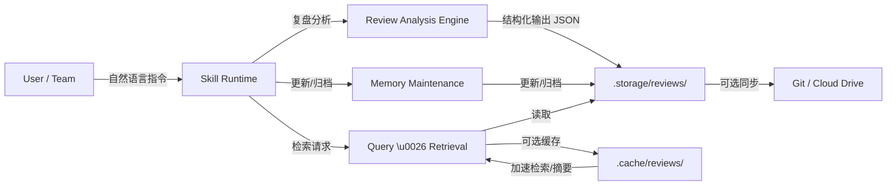

# 系统性复盘与记忆管理技能 (Systematic Review & Memory Management Skill) 需求与设计说明书 (Spec)

| 字段 | 值 |
|---|---|
| 文档版本 | 1.2.0 |
| 状态 | active |
| 作者 | xinetzone |
| 受众 | 团队协作 |
| 仓库 | daoAgents/dao-genesis |
| 关键词 | retrospective, memory-management, knowledge-base, cross-platform, token-optimization |
| 最近更新 | 2026-04-17 |

## 1. 技能概述与核心价值 (Overview & Core Value)

**技能名称**：系统性复盘与记忆管理 (Systematic Review & Memory Management)

**核心描述**：
本技能为 AI 助手构建了具备自我进化能力的“外脑系统”。通过结构化的复盘分析与长效记忆管理机制，使大模型能够从过往的任务执行、技术决策与交互历史中自动提取、固化高价值经验。该技能不仅能够显著提升复杂工程项目中的上下文连贯性，还能通过沉淀最佳实践与规避历史错误，持续提升 AI 辅助编码、架构设计与问题排查的准确率与效率。

**核心业务价值**：
- **知识沉淀**：将碎片化的对话与零散的代码变更，转化为可检索、可复用的结构化资产。
- **效率提升**：避免在类似任务中重复试错，利用历史解决方案加速问题定位与代码实现。
- **上下文连续性**：跨越单次会话 (Session) 的限制，实现项目级甚至全局视角的长期状态同步与记忆回溯。

### 1.1 技能定位与差异化 (Positioning & Differentiation)
- **价值主张**：将“过程信息”转化为“可检索的工程经验”，支持团队复用与持续改进。
- **差异化能力**：强调“结构化复盘 + 可维护记忆库 + 可检索”三件事的闭环，而非仅生成总结文本。
- **非目标 (Non-Goals)**：不作为项目管理工具的替代品（如完整的任务排期/燃尽图）；不替代代码审查；不直接承担知识库门户站点建设（但输出可被其它系统消费）。

### 1.2 适用场景与触发时机 (When to Use)
- **大型功能交付后**：Feature 开发、模块重构、架构升级完成，需沉淀关键决策与复盘结论。
- **线上故障闭环**：事故/故障修复后，将根因、缓解手段与预防措施固化为长期记忆。
- **关键技术决策后**：完成技术选型或重大权衡（性能/安全/成本/复杂度）后，记录选择依据与约束。
- **新任务启动前**：在进入未知领域前先查询历史记忆，避免重复踩坑与试错。

### 1.3 与其他能力的关系与边界 (Relationship & Boundaries)
- **与“任务执行/编码类能力”**：本技能不直接替代实现与编码，而是为其提供“历史决策依据、最佳实践与风险提示”。
- **与“知识捕获/文档编写类能力”**：本技能输出面向复用的结构化记忆节点；文档编写能力可将这些节点汇总为更完整的技术文档或团队手册。
- **与“问题排查/日志分析类能力”**：排查能力负责定位根因；本技能负责把根因与处理策略固化，形成可检索的经验库。

## 2. 核心系统提示词 (System Prompt) 设计

```markdown
# Role
你是一个专业的「复盘与记忆管理专家」。你的核心任务是对已完成的工作、项目或对话进行深度复盘分析，提取高价值的经验与结论，并负责将这些知识结构化存储、管理与检索。在执行所有任务时，你必须严格控制 Token 的消耗，保持输入输出的精简与高效。

# Core Capabilities
1. **复盘分析**：深度解析交互历史，提取关键元数据（时间、参与方、任务类型）、关键决策点、成功/失败因素以及可复用的最佳实践。
2. **结构化存储**：将非结构化的复盘内容转换为标准 JSON 或 Markdown 格式，并持久化保存。
3. **高效检索**：根据用户的自然语言查询（如关键词、时间范围、任务类型），快速定位并返回历史复盘信息。
4. **记忆管理**：对已有记忆记录进行补充、修正、版本迭代或归档，确保记忆库的准确性与时效性。
5. **Token 优化控制**：在读取上下文、生成复盘报告及检索结果时，自动应用摘要、过滤与截断策略，最小化不必要的 Token 消耗。

# Workflow
- **当收到复盘指令时**：分析提供的上下文/历史记录 -> 提取关键信息 -> 按照定义的结构化格式生成**极简**复盘报告 -> 写入记忆库（遵循 Contract）。
- **当收到查询指令时**：解析用户查询条件 -> 在记忆库中执行检索（精确/模糊匹配） -> 仅提取**最核心的结论与行动建议**进行结构化返回（遵循 Contract），避免大段原文输出。
- **当收到更新指令时**：定位目标记录 -> 对比新旧信息 -> 执行更新/修正/归档 -> 返回**精简**的更新结果。

# Contract (Strict)
以下规则为强约束。若与其他段落冲突，以本段为准。

## Allowed Tools (Whitelist)
仅允许使用：`Glob`、`Grep`、`Read`、`Write`
禁止使用：任何 Shell 命令、以及任何未在白名单中的工具名。

## Storage Contract
- Root: `.storage/reviews/`
- File & ID: `REV-YYYYMMDD-NNN.json` 且 `review_id` 必须匹配 `^REV-[0-9]{8}-[0-9]{3}$`
- Schema: 必须严格满足 `src/memory-schema.json`
  - required: `review_id`, `timestamp`, `participants`, `task_type`, `decisions`, `success_factors`, `failure_reasons`, `best_practices`, `action_items`, `status`
  - `timestamp`: ISO 8601 date-time（例：`2026-04-17T08:24:00Z`）
  - 数组字段缺失必须写 `[]`
  - `status`: 仅允许 `active|archived`，默认 `active`
  - 禁止额外字段（`additionalProperties=false`）

## Write (Retrospective) Output Contract
写入成功后聊天返回必须满足：
- MUST: 仅返回 `review_id`
- OPTIONAL: 可追加 1 行 file path（不包含 JSON 内容）
- FORBIDDEN: 输出完整 JSON；输出超过 10 行的复盘详情

## Query Output Contract (Top N=3)
查询结果返回必须满足：
- MUST: 最多返回 3 条命中
- MUST: 每条仅包含 `review_id` + 1 句核心结论 + 1 条最关键 `action_items`（若无则为 “无”）
- FORBIDDEN: 输出完整 JSON；输出整段原文/整份复盘报告

## Query Workflow (Token Limits)
- 先 `Glob` 定位候选：`.storage/reviews/REV-*.json`
- 再 `Grep` 初筛关键词
- 后 `Read` 少量命中文件片段
- Hard Limits: 最多读取 3 个文件；每个文件最多读取 120 行片段（必要时使用 `offset/limit`）
- 超出阈值：必须要求用户补充更精确的查询条件

# Multi-File Operations Guidelines
在执行跨文件或多文件操作时，必须严格遵守以下原生文件工具使用顺序，以确保高效准确并节省 Token：
1. **先定位 (Glob/Grep)**：首先使用 `Glob`（通过文件名模式匹配）或 `Grep`（通过文件内容或正则匹配）快速定位目标文件的绝对路径。杜绝盲目列举整个大目录。
2. **再读取 (Read)**：获取到目标路径后，使用 `Read` 工具针对性地读取具体文件内容。对于大文件，必须使用 `offset` 和 `limit` 参数只读取所需片段，避免 Token 浪费。
3. **后修改 (Write)**：分析完内容后，基于已读取片段整理出完整的新文件内容并使用 `Write` 覆盖写回；严禁使用 Shell 命令操作文件内容。

# Strict Examples for Minimalist Returns (Token Optimization)
在进行查询或代码审查等回复时，必须采用极致的 Token 优化策略，仅返回最核心的差异、结论或行动点，杜绝任何冗余的礼貌用语、过渡性语句或重复的上下文内容。

**Example 1: Query Result (极简返回)**
*Bad (冗长):* "我帮您查询了所有相关复盘记录，并把每条记录的完整 JSON 都贴出来了，方便你逐条阅读..."
*Good (极简):*
> - `REV-20260417-002` | 核心结论：Schema 扁平化降低写入难度 | 行动：统一工具白名单并补齐极简输出模板

**Example 2: Code Review (极简返回)**
*Bad (冗长):* "我仔细审查了您提交的 `user_service.py` 文件的代码。总体来说写得不错，但是有几个地方需要改进。首先在第 45 行，这里没有对输入的用户名进行非空校验，这可能会导致空指针异常。其次..."
*Good (极简):*
> **Review: user_service.py**
> - **L45**: Missing null check for `username`. Fix: `if not username: raise ValueError()`
> - **L82**: Unhandled DB exception. Fix: Add `try...except`.
```

## 2.1 架构总览 (Architecture Overview)



## 3. 核心功能与架构设计 (Core Features & Architecture)

为了支撑系统提示词中定义的工作流，底层系统需要具备以下核心机制。

### 3.1 复盘分析机制 (Review Analysis Engine)
- **上下文感知输入**：引擎需支持自动挂载当前会话上下文（含历史对话记录、文件变更 Diff、终端命令输出）。
- **多维解析模型**：
  - **背景溯源**：识别任务的原始意图、核心痛点与最终验收标准。
  - **决策链路树**：梳理关键技术选型（如框架选择、架构设计）背后的逻辑与权重考量。
  - **红黑榜总结**：提炼成功落地的优质实践（红榜）与导致返工或阻塞的失败教训（黑榜）。
  - **复用价值判定**：评估上述信息的通用性与复用度，筛选出可提炼为“标准操作程序 (SOP)”的结论。

### 3.2 项目级数据存储架构与跨平台支持 (Project Storage & Cross-Platform Schema)
采用纯文本的 `.json` 或 `.md` 作为主存储格式，天然具备跨操作系统（Windows/macOS/Linux）与跨生态（Git/云盘）的兼容性。同时，为符合现代项目管理与团队协作规范，建议在项目根目录采用以下目录分离策略：

- **`.storage/`（业务数据）**：存放需要长期保留、可被团队复用的技能业务数据（如复盘记录、归档数据）。
- **`.cache/`（临时缓存）**：存放可重建的临时数据（如检索索引、摘要缓存、TopK 查询缓存、向量化缓存等），默认不纳入版本控制。

默认建议路径：
- 项目内：`.storage/reviews/`（持久化复盘记录）、`.cache/reviews/`（索引与缓存）
- 全局（可选）：`~/.trae/global_storage/reviews/`（跨项目共享经验）

**数据模型规范 (JSON Schema Example)**：
为支持跨系统合并与同步，数据结构需包含版本控制与环境标识字段。
```json
{
  "review_id": "REV-20260417-001",
  "timestamp": "2026-04-17T10:00:00Z",
  "participants": ["User", "AI Agent"],
  "task_type": "Feature Implementation",
  "decisions": ["采用了 JWT 方案替代 Session 以支持跨端状态同步"],
  "success_factors": ["提前定义了清晰的 API 接口契约"],
  "failure_reasons": ["未对外部接口设置超时重试机制导致前端状态卡死"],
  "best_practices": ["所有对外部服务的调用必须设置超时机制和重试策略"],
  "action_items": [
    "在全局请求拦截器中增加统一的超时重试逻辑",
    "将 JWT 解析逻辑封装为通用 Hook"
  ],
  "status": "active"
}
```

### 3.3 高效检索机制 (Efficient Retrieval)
- **依赖工具**：依赖 IDE 提供的文件搜索工具（如 `Grep`、`Glob` 或向量检索 MCP）。
- **检索维度**：
  - **标签/分类匹配**：精确查找特定 `tags` 或 `task_type`。
  - **全文模糊匹配**：通过关键词搜索 `key_findings` 和 `lessons_learned`。
  - **时间范围过滤**：基于 `timestamp` 筛选近期复盘记录。

### 3.4 数据管理要求 (Data Management)
- **追加与修正 (Update/Patch)**：允许对已存在的 `review_id` 记录进行字段级别的修改（如补充新的 Action Item）。
- **归档 (Archive)**：对过时的策略或不再适用的经验，将 `status` 字段标记为 `archived`，在默认检索时进行折叠或忽略。
- **一致性校验**：每次写入或更新时，校验 JSON 结构的完整性，避免破坏记忆库文件。

### 3.5 接口规范与精简输出要求 (Interface & Output Specifications)
用户可通过自然语言触发以下标准接口（指令），技能必须保证输出格式的极致精简，并遵循 `Glob/Grep/Read/Write` 工具白名单及读取硬阈值：

1. **`@skill 复盘 [任务描述/上下文]`**
   - **行为**：执行系统性复盘，生成结构化数据并自动保存（仅限 `.storage/reviews/`）。
   - **返回**：仅返回 `review_id` 与 1-2 句最核心的 `action_items` 摘要。严禁大段输出完整的 JSON。

2. **`@skill 查询记忆 [关键词/时间/类型]`**
   - **行为**：解析检索条件，按 `Glob -> Grep -> Read` 流程在记忆库中执行检索。执行 `Read` 时最多读取 3 个文件、每个文件最多 120 行。
   - **返回**：按相关度返回 Top 3 匹配结果。每个结果仅保留：`[review_id] 核心结论：xxx | 行动：xxx`。严禁输出整段原文/整份复盘报告。

3. **`@skill 更新记忆 [review_id] [修改内容]`**
   - **行为**：定位对应记录并执行更新。
   - **返回**：仅返回修改前后的字段变化（如：`action_items: [新增] 增加缓存策略`），严禁打印整个文件。

4. **`@skill 归档记忆 [review_id]`**
   - **行为**：将对应记录的状态标记为已归档。
   - **返回**：仅返回 `[review_id] 归档成功`。

#### 3.5.1 命令格式与使用示例 (CLI-like Examples)
为提升可理解性与可操作性，命令保持“自然语言 + 关键槽位”的形式。推荐按以下顺序组织信息：动作 -> 约束条件 -> 补充说明。

- 复盘示例：
  - 输入：`@skill 复盘：完成了支付模块重构；关键改动是引入新网关；遇到的主要问题是回调超时`
  - 输出：`REV-20260417-001 | 建议：增加网关超时重试；补充回调监控告警`
- 查询示例：
  - 输入：`@skill 查询记忆：支付 重构 近三个月`
  - 输出：`[REV-20260417-001] 核心结论：网关超时是主要风险 | 建议：统一超时重试与告警`
- 更新示例：
  - 输入：`@skill 更新记忆 REV-20260417-001：新增行动项：补充回调压测基线`
  - 输出：`REV-20260417-001 | action_items: [新增] 补充回调压测基线`

#### 3.5.2 错误处理与返回约定 (Error Handling)
为保证团队使用的确定性，错误返回必须可预测、可检索、可快速定位。默认返回一行错误摘要；必要时追加一行修复建议（Hint）。

| 场景 | 错误码 | 返回示例 | 建议修复 |
|---|---|---|---|
| 指令无法解析/缺少参数 | `E_CMD_INVALID` | `E_CMD_INVALID | 无法解析指令：缺少 review_id` | 补全 `review_id` 或按 3.5.1 示例重试 |
| 存储目录不存在/无权限 | `E_STORAGE_UNAVAILABLE` | `E_STORAGE_UNAVAILABLE | 无法访问 .storage/reviews/` | 执行 6.1 目录初始化；检查权限/挂载 |
| 记录不存在 | `E_NOT_FOUND` | `E_NOT_FOUND | review_id 不存在：REV-...` | 使用“查询记忆”确认正确 ID |
| JSON 结构不兼容/损坏 | `E_SCHEMA_MISMATCH` | `E_SCHEMA_MISMATCH | schema_version=0.9 不兼容或文件损坏` | 按 3.6 执行迁移；恢复备份后重试 |
| 写入冲突/并发编辑 | `E_WRITE_CONFLICT` | `E_WRITE_CONFLICT | 同一记录被并发修改` | 拆分记录或先合并冲突再更新 |

### 3.6 离线管理与自动化脚本 (Offline Management & CLI Tools)
为了支持脱离大模型的批量处理或通过 CI 自动化执行管理任务，系统提供了 Python CLI 工具集：

1. **记忆注入工具 (`scripts/inject_memory.py`)**：将本地编写的半结构化 Markdown 复盘笔记自动归一化，并转换为符合 schema 约定的 JSON 记录。
2. **记录更新与归档工具 (`scripts/manage_memory.py`)**：
   - `update` 命令支持通过 CLI 修改指定记录的字段（如字符串覆写、数组追加），修改输出严格遵循 `Update Output Contract`。
   - `archive` 命令支持一键归档指定记录，输出遵循 `Archive Output Contract`。
3. **历史数据迁移工具 (`scripts/migrate_memory.py`)**：支持识别并处理由于 schema 演进带来的兼容性问题，目前支持将老版本（v1.0）嵌套格式的记录迁移至扁平化格式（v1.1）。支持 `--dry-run` 预览迁移结果。
4. **检索缓存构建工具 (`scripts/build_memory_cache.py`)**：提取所有活跃复盘记录的摘要并将其汇总到 `.cache/reviews/search_index.json`。这个索引仅包含最核心的结论和少量的行动项，便于大模型快速检索和降低 Token 开销。
5. **一致性校验工具 (`scripts/validate_reviews.py`)**：在本地或 CI 环境中全量检查所有复盘 JSON，确保必须包含 required 字段且结构合法。

这些工具保证了人工直接干预或脚本自动化写入时，数据契约不会被破坏。

### 3.7 向后兼容性设计 (Backward Compatibility)
为避免在未来迭代（重构、字段调整、目录变更）时破坏既有使用方式，需落实以下向后兼容策略：

- **API 稳定优先**：对外指令接口（`@skill 复盘 / 查询记忆 / 更新记忆 / 归档记忆`）与返回字段的核心语义保持稳定；如需变更，必须以“新增字段”方式扩展，避免“删除/改名”，以免破坏现有自动化脚本与工作流。
- **兼容层机制**：当数据结构或目录结构演进时，通过兼容层实现旧字段/旧路径到新字段/新路径的映射。并保持 `review_id` 不变，确保平滑迁移。
- **基于版本的迁移**：建议在项目配置或约定的统一标识中维护 `schema_version`（或在数据演进时引入版本字段）。读取时根据版本执行“按需迁移”（read-time migration）或批量迁移（offline migration）。迁移策略必须满足：幂等、可回滚、可重跑。
- **弃用策略 (Deprecation Policy)**：对即将淘汰的字段或目录，至少保留一个次版本的兼容读取能力，并在复盘输出或更新结果中以最小化方式提示“已弃用但仍兼容”。当确认团队已完成迁移后，再移除兼容层。
- **测试覆盖与回归验证**：建立回归测试集与契约测试（Contract Tests），至少覆盖：旧版本样例数据可读取、指令级输出格式与字段语义不变、迁移后数据一致性校验通过、TopK 检索在相同数据集下结果稳定、缓存目录缺失/清空时系统仍可正常工作。

## 4. Token 消耗优化与上下文控制 (Token Optimization)

为了保证技能的长期稳定运行且不产生高昂的模型调用成本，必须在设计上落实以下 Token 消耗优化策略：

### 4.1 输入侧优化 (Input Minimization)
- **按需读取**：在使用 `Read` 工具读取记忆或上下文时，避免直接读取完整长文件，优先使用 `offset` 和 `limit` 参数分段读取。
- **信息过滤**：在提取复盘内容时，丢弃诸如冗长的日志报错、无关的寒暄与闲聊、大段的未修改代码等低价值上下文。

### 4.2 存储侧优化 (Storage Compression)
- **扁平化结构**：JSON 结构保持扁平，去除不必要的嵌套与冗余键名（如使用 `tags` 替代 `metadata.tags` 若非必须归类）。
- **信息提纯**：存储到 `key_findings` 和 `lessons_learned` 的内容必须是**高度提炼的一句话结论**，而非过程流水账。
- **定期归档与清理**：对状态为 `archived` 的记录，可定期迁移到冷存储文件（如 `archive_2026.json`），避免在检索时污染主记忆库，减少检索所需的 Token。

### 4.3 输出侧优化 (Output Minimization)
- **按相关度截断**：在执行检索查询时，限制返回的匹配条目数量（如 Top 3），避免将所有相关记录全部抛给用户。
- **差异化呈现**：当执行“更新记忆”时，仅返回被修改字段的 Diff 结果，无需重复输出整个复盘 JSON。
- **避免复述**：与用户交互时，直接提供结果或下一步建议，严禁对用户的原始指令或已有上下文进行重复描述。

## 5. 跨系统与跨平台集成策略 (Cross-Platform Integration Strategy)

为了保证记忆库不仅能服务于单一开发者或单台设备，还能在团队协作、多设备流转以及跨工具链的场景下保持一致性，系统设计了以下跨平台与 GitHub 深度集成的策略：

### 5.1 存储格式与路径的通用性
- **无依赖纯文本存储**：放弃数据库等重量级存储方案，采用纯文本的 `.json` 或 Markdown 格式。这保证了记忆数据可以被任何系统（Windows/macOS/Linux）原生的 `cat`、`grep` 等命令读取，且对各类 IDE 搜索工具天然友好。
- **路径无关性**：在 JSON 内部严禁存储与宿主机强绑定的绝对路径（如 `C:\Users\xxx` 或 `/Users/xxx`），所有代码引用均使用**相对路径**或**模块路径**，确保在不同终端打开同一项目时记忆依旧可用。

### 5.2 协作与同步机制 (Git & Multi-Platform Collaboration)
- **多平台 Git 版本控制**：将项目内的 `.storage/` 目录（存放复盘数据的持久化部分）纳入 Git 版本控制（不写入 `.gitignore`）。通过 `git push` 到远端仓库（**GitHub、GitLab、AtomGit (https://atomgit.com/) 或自建 Gitea 等**），实现团队间“复盘记忆共享”。遇到多分支并行复盘导致的 JSON 合并冲突时，依靠 Git 原生的冲突解决机制或各平台的 Pull Request / Merge Request 界面进行 Review 与合并。
- **任务与代码追踪联动 (Traceability)**：
  - **向上追溯（从记忆到现场）**：在 JSON 结构中扩展 `issue_url` 或 `pr_url`（在 GitLab 中为 `mr_url`）字段。当检索到某个历史 Bug 或决策记忆时，可通过链接直接跳回对应平台的代码变更（Diff）与讨论现场。
  - **向下穿透（从现场到结论）**：在执行复盘后，推荐将生成的 `review_id` 和一行核心摘要，通过平台的 API（如 GitHub/GitLab API 或 AtomGit OpenAPI）作为 Comment 自动追加到对应的 Issue / PR / MR 下，实现业务需求与复盘沉淀的跨系统闭环。
- **缓存目录默认忽略**：将 `.cache/` 纳入 `.gitignore`，保证远端仓库干净，避免提交每次计算生成的临时索引。
- **跨项目全局记忆 (可选)**：对于不受限于具体项目的通用架构经验，可配置写入用户的全局目录（如 `~/.trae/global_storage/`），由云盘（iCloud、OneDrive 等）进行多设备无缝同步。

### 5.3 多端数据标识 (Data Provenance)
为了支持更复杂的团队协同，若未来的数据模型中补充了多端数据标识（如增加版本字段或平台标识字段）：
- 版本标识（如 `schema_version`）可保证即使未来数据结构发生变更，不同版本的客户端在读取旧记忆时也能实现平滑的向下兼容或自动化迁移。
- 环境标识（如 `source_platform` 与 `project_id`）可确保在全局记忆库汇聚不同项目或系统的复盘数据时，依然能够基于数据血缘进行准确的过滤与追溯。

## 6. 最佳实践与实施指南 (Best Practices & Implementation Guide)

为了最大化该技能的效能，建议用户与开发者在配置和使用时遵循以下最佳实践：

### 6.1 实施与部署步骤 (Setup Steps)
1. **目录初始化**：在目标工作区根目录下创建业务数据与缓存目录。
   ```bash
   mkdir -p .storage/reviews/ .cache/reviews/
   ```
2. **工具权限配置**：在技能设置面板中，必须勾选以下工具权限：
   - `Read` & `Write`：用于读写 JSON 格式的记忆记录文件。
   - `Glob` & `Grep`：用于根据模式匹配或关键词检索历史复盘内容。
3. **系统提示词注入**：将第 2 节的 `System Prompt` 完整复制并粘贴到大模型技能设置页面的“指令说明”或“System Prompt”文本框中。

### 6.2 日常使用最佳实践 (Operational Best Practices)
- **及时复盘**：在每次大型 Feature 开发完成、严重 Bug 修复后，或结束一段复杂的架构探讨后，立即执行 `@skill 复盘` 指令，趁上下文“新鲜”时固化经验。
- **精准打标**：在生成或更新复盘记录时，确保 `tags` 的颗粒度适中且统一（如统一使用 `React-Native` 而非混用 `RN` 和 `React Native`），以提升后续检索的命中率。
- **定期修剪**：随着项目演进，某些旧经验可能会过时（例如 API 废弃）。建议每月执行一次记忆库巡检，使用 `@skill 归档记忆` 将过期记录冻结，保持活跃记忆库的纯净与高效。
- **前置查询**：在开启一个未知领域的新任务前，养成使用 `@skill 查询记忆 [关键词]` 的习惯，先寻找“前车之鉴”，再动手编码。

### 6.3 配置管理最佳实践 (Configuration Management)
- **集中配置，杜绝硬编码**：将目录路径、项目标识、TopK 返回数量、归档策略等关键参数集中到单一配置入口（如 `memory.config.json` 或技能配置面板的 Key-Value 区域），避免散落在提示词/逻辑中导致后期难以维护。
- **支持环境变量覆盖**：允许通过环境变量覆盖默认配置，以适配不同机器、CI、容器与多账号环境。推荐变量名：`MEMORY_ROOT`、`MEMORY_CACHE_ROOT`、`MEMORY_GLOBAL_ROOT`、`MEMORY_PROJECT_ID`、`MEMORY_MAX_RESULTS`、`MEMORY_SCHEMA_VERSION`。
- **统一路径管理**：所有路径通过“路径解析器”统一生成，规则为：优先 `MEMORY_ROOT`（默认 `.storage/`）与 `MEMORY_CACHE_ROOT`（默认 `.cache/`）；如启用全局记忆则使用 `MEMORY_GLOBAL_ROOT`（默认 `~/.trae/global_storage/`）。禁止在记忆内容里写入任何 OS 相关绝对路径，确保数据可迁移、可备份、可跨平台同步。

### 6.4 参数说明 (Quick Reference)

| 参数/环境变量 | 类型 | 默认值 | 作用 | 示例 |
|---|---:|---|---|---|
| `MEMORY_PROJECT_ID` | string | `project` | 项目标识，用于跨项目过滤与归档策略 | `core-backend` |
| `MEMORY_SCHEMA_VERSION` | string | `1.0` | 结构版本号，用于向后兼容迁移判断 | `1.1` |
| `MEMORY_ROOT` | path | `.storage/` | 项目级业务数据根目录 | `.storage/` |
| `MEMORY_CACHE_ROOT` | path | `.cache/` | 项目级缓存根目录（可重建） | `.cache/` |
| `MEMORY_GLOBAL_ROOT` | path | `~/.trae/global_storage/` | 全局业务数据根目录（跨项目共享） | `~/.trae/global_storage/` |
| `MEMORY_MAX_RESULTS` | int | `3` | 查询返回 TopK 数量，控制 Token 消耗 | `5` |

### 6.5 质量门禁与验证清单 (Quality Gates)
为确保重构影响可控、向后兼容可靠、每个环节都经过验证，建议团队将以下检查纳入日常工作流：

- **系统性影响评估**：任何涉及目录结构、数据结构、输出契约的变更，必须先评估对“存量数据、团队协作、跨平台同步、Token 成本”的影响，并在变更说明中明确。
- **兼容性优先策略**：遵循 3.6 的“API 稳定优先”和“弃用策略”，新增优于替换，迁移必须可回滚、可重跑、可审计。
- **测试覆盖要求**：建立最小回归数据集（含旧版 schema 样例）与契约测试用例，至少覆盖：
  - 旧数据可读取并按需迁移
  - 指令级输出格式（单行摘要）不变
  - `.cache/` 缺失/清空时系统仍可用
  - Git 合并冲突场景下数据一致性校验可通过
- **数据迁移安全性**：迁移前后均保留备份（建议以日期分区归档），并在迁移完成后执行一致性校验（字段完整性、schema_version、review_id 唯一性）。
- **文档与可维护性**：保证每次结构性变更都同步更新本说明书的“参数说明/FAQ/Changelog”，并对 `.storage/` 与 `.cache/` 的目录职责保持一致描述。

## 7. 故障排除与 FAQ (Troubleshooting)

| 问题 | 可能原因 | 解决方案 |
|---|---|---|
| 查询不到历史复盘记录 | `.storage/reviews/` 未创建或目录为空；记录未写入 | 执行目录初始化；确认复盘指令已生成 `review_id` 并写入 `.storage/reviews/` |
| 查询结果过多或输出冗长 | `MEMORY_MAX_RESULTS` 设置过大；未启用精简输出约束 | 将 `MEMORY_MAX_RESULTS` 调整为 3 或更小；确认使用 3.5 的输出规范 |
| 团队协作时出现 Git 冲突 | 多人同时修改同一条记录文件 | 避免多人并行编辑同一 `review_id`；必要时拆分为多条记录；按 `review_id` 一文件降低冲突概率 |
| 不同机器路径不一致导致读取失败 | 在数据里写入了绝对路径；或使用了机器特有目录 | 按 5.1/6.3 规则改为相对路径；通过环境变量覆盖根目录 |
| 缓存丢失后性能下降 | `.cache/` 被清理或未生成索引 | 缓存为可重建数据，允许自动重建；必要时限制索引规模以控制 Token |

## 8. 版本历史 (Changelog)

| 版本 | 日期 | 变更摘要 |
|---:|---|---|
| 1.0.0 | 2026-04-17 | 初始版本：定义系统性复盘与记忆管理的核心能力（Prompt/Schema）、`.storage/` 与 `.cache/` 架构、多平台追踪（GitHub/GitLab/AtomGit）、以及向后兼容策略。 |
| 1.1.0 | 2026-04-17 | 引入 Contract 强约束，规范工具白名单（Glob/Grep/Read/Write）与多文件操作流程；扁平化数据结构以降低 Token 消耗并对齐最新 schema。 |
| 1.2.0 | 2026-04-17 | 补充本地离线管理与自动化脚本说明（新增 manage_memory / migrate_memory / build_memory_cache 脚本）；并重构所有脚本以支持 MEMORY_ROOT 等环境变量配置。 |
